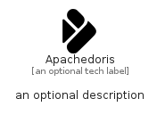

# Apachedoris


```text
simpleicons-14/A/Apachedoris
```

```text
include('simpleicons-14/A/Apachedoris')
```


| Illustration | Apachedoris |
| :---: | :---: |
|  |  |


## Sprites
The item provides the following sriptes:

- `<$ApachedorisXs>`
- `<$ApachedorisSm>`
- `<$ApachedorisMd>`
- `<$ApachedorisLg>`


## Apachedoris

### Load remotely
```plantuml
@startuml
' configures the library
!global $LIB_BASE_LOCATION="https://raw.githubusercontent.com/tmorin/plantuml-libs/master/distribution"

' loads the library's bootstrap
!include $LIB_BASE_LOCATION/bootstrap.puml

' loads the package bootstrap
include('simpleicons-14/bootstrap')

' loads the Item which embeds the element Apachedoris
include('simpleicons-14/A/Apachedoris')

' renders the element
Apachedoris('Apachedoris', 'Apachedoris', 'an optional tech label', 'an optional description')
@enduml
```

### Load locally
```plantuml
@startuml
' configures the library
!global $INCLUSION_MODE="local"
!global $LIB_BASE_LOCATION="../.."

' loads the library's bootstrap
!include $LIB_BASE_LOCATION/bootstrap.puml

' loads the package bootstrap
include('simpleicons-14/bootstrap')

' loads the Item which embeds the element Apachedoris
include('simpleicons-14/A/Apachedoris')

' renders the element
Apachedoris('Apachedoris', 'Apachedoris', 'an optional tech label', 'an optional description')
@enduml
```

