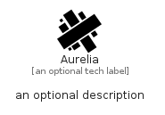

# Aurelia


```text
simpleicons-14/A/Aurelia
```

```text
include('simpleicons-14/A/Aurelia')
```


| Illustration | Aurelia |
| :---: | :---: |
|  |  |


## Sprites
The item provides the following sriptes:

- `<$AureliaXs>`
- `<$AureliaSm>`
- `<$AureliaMd>`
- `<$AureliaLg>`


## Aurelia

### Load remotely
```plantuml
@startuml
' configures the library
!global $LIB_BASE_LOCATION="https://raw.githubusercontent.com/tmorin/plantuml-libs/master/distribution"

' loads the library's bootstrap
!include $LIB_BASE_LOCATION/bootstrap.puml

' loads the package bootstrap
include('simpleicons-14/bootstrap')

' loads the Item which embeds the element Aurelia
include('simpleicons-14/A/Aurelia')

' renders the element
Aurelia('Aurelia', 'Aurelia', 'an optional tech label', 'an optional description')
@enduml
```

### Load locally
```plantuml
@startuml
' configures the library
!global $INCLUSION_MODE="local"
!global $LIB_BASE_LOCATION="../.."

' loads the library's bootstrap
!include $LIB_BASE_LOCATION/bootstrap.puml

' loads the package bootstrap
include('simpleicons-14/bootstrap')

' loads the Item which embeds the element Aurelia
include('simpleicons-14/A/Aurelia')

' renders the element
Aurelia('Aurelia', 'Aurelia', 'an optional tech label', 'an optional description')
@enduml
```

