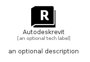

# Autodeskrevit


```text
simpleicons-14/A/Autodeskrevit
```

```text
include('simpleicons-14/A/Autodeskrevit')
```


| Illustration | Autodeskrevit |
| :---: | :---: |
|  |  |


## Sprites
The item provides the following sriptes:

- `<$AutodeskrevitXs>`
- `<$AutodeskrevitSm>`
- `<$AutodeskrevitMd>`
- `<$AutodeskrevitLg>`


## Autodeskrevit

### Load remotely
```plantuml
@startuml
' configures the library
!global $LIB_BASE_LOCATION="https://raw.githubusercontent.com/tmorin/plantuml-libs/master/distribution"

' loads the library's bootstrap
!include $LIB_BASE_LOCATION/bootstrap.puml

' loads the package bootstrap
include('simpleicons-14/bootstrap')

' loads the Item which embeds the element Autodeskrevit
include('simpleicons-14/A/Autodeskrevit')

' renders the element
Autodeskrevit('Autodeskrevit', 'Autodeskrevit', 'an optional tech label', 'an optional description')
@enduml
```

### Load locally
```plantuml
@startuml
' configures the library
!global $INCLUSION_MODE="local"
!global $LIB_BASE_LOCATION="../.."

' loads the library's bootstrap
!include $LIB_BASE_LOCATION/bootstrap.puml

' loads the package bootstrap
include('simpleicons-14/bootstrap')

' loads the Item which embeds the element Autodeskrevit
include('simpleicons-14/A/Autodeskrevit')

' renders the element
Autodeskrevit('Autodeskrevit', 'Autodeskrevit', 'an optional tech label', 'an optional description')
@enduml
```

