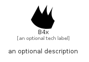

# B4X


```text
simpleicons-14/B/B4X
```

```text
include('simpleicons-14/B/B4X')
```


| Illustration | B4X |
| :---: | :---: |
|  |  |


## Sprites
The item provides the following sriptes:

- `<$B4XXs>`
- `<$B4XSm>`
- `<$B4XMd>`
- `<$B4XLg>`


## B4X

### Load remotely
```plantuml
@startuml
' configures the library
!global $LIB_BASE_LOCATION="https://raw.githubusercontent.com/tmorin/plantuml-libs/master/distribution"

' loads the library's bootstrap
!include $LIB_BASE_LOCATION/bootstrap.puml

' loads the package bootstrap
include('simpleicons-14/bootstrap')

' loads the Item which embeds the element B4X
include('simpleicons-14/B/B4X')

' renders the element
B4X('B4x', 'B4x', 'an optional tech label', 'an optional description')
@enduml
```

### Load locally
```plantuml
@startuml
' configures the library
!global $INCLUSION_MODE="local"
!global $LIB_BASE_LOCATION="../.."

' loads the library's bootstrap
!include $LIB_BASE_LOCATION/bootstrap.puml

' loads the package bootstrap
include('simpleicons-14/bootstrap')

' loads the Item which embeds the element B4X
include('simpleicons-14/B/B4X')

' renders the element
B4X('B4x', 'B4x', 'an optional tech label', 'an optional description')
@enduml
```

