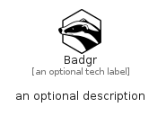

# Badgr


```text
simpleicons-14/B/Badgr
```

```text
include('simpleicons-14/B/Badgr')
```


| Illustration | Badgr |
| :---: | :---: |
|  |  |


## Sprites
The item provides the following sriptes:

- `<$BadgrXs>`
- `<$BadgrSm>`
- `<$BadgrMd>`
- `<$BadgrLg>`


## Badgr

### Load remotely
```plantuml
@startuml
' configures the library
!global $LIB_BASE_LOCATION="https://raw.githubusercontent.com/tmorin/plantuml-libs/master/distribution"

' loads the library's bootstrap
!include $LIB_BASE_LOCATION/bootstrap.puml

' loads the package bootstrap
include('simpleicons-14/bootstrap')

' loads the Item which embeds the element Badgr
include('simpleicons-14/B/Badgr')

' renders the element
Badgr('Badgr', 'Badgr', 'an optional tech label', 'an optional description')
@enduml
```

### Load locally
```plantuml
@startuml
' configures the library
!global $INCLUSION_MODE="local"
!global $LIB_BASE_LOCATION="../.."

' loads the library's bootstrap
!include $LIB_BASE_LOCATION/bootstrap.puml

' loads the package bootstrap
include('simpleicons-14/bootstrap')

' loads the Item which embeds the element Badgr
include('simpleicons-14/B/Badgr')

' renders the element
Badgr('Badgr', 'Badgr', 'an optional tech label', 'an optional description')
@enduml
```

