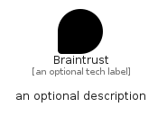

# Braintrust


```text
simpleicons-14/B/Braintrust
```

```text
include('simpleicons-14/B/Braintrust')
```


| Illustration | Braintrust |
| :---: | :---: |
|  |  |


## Sprites
The item provides the following sriptes:

- `<$BraintrustXs>`
- `<$BraintrustSm>`
- `<$BraintrustMd>`
- `<$BraintrustLg>`


## Braintrust

### Load remotely
```plantuml
@startuml
' configures the library
!global $LIB_BASE_LOCATION="https://raw.githubusercontent.com/tmorin/plantuml-libs/master/distribution"

' loads the library's bootstrap
!include $LIB_BASE_LOCATION/bootstrap.puml

' loads the package bootstrap
include('simpleicons-14/bootstrap')

' loads the Item which embeds the element Braintrust
include('simpleicons-14/B/Braintrust')

' renders the element
Braintrust('Braintrust', 'Braintrust', 'an optional tech label', 'an optional description')
@enduml
```

### Load locally
```plantuml
@startuml
' configures the library
!global $INCLUSION_MODE="local"
!global $LIB_BASE_LOCATION="../.."

' loads the library's bootstrap
!include $LIB_BASE_LOCATION/bootstrap.puml

' loads the package bootstrap
include('simpleicons-14/bootstrap')

' loads the Item which embeds the element Braintrust
include('simpleicons-14/B/Braintrust')

' renders the element
Braintrust('Braintrust', 'Braintrust', 'an optional tech label', 'an optional description')
@enduml
```

