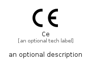

# Ce


```text
simpleicons-14/C/Ce
```

```text
include('simpleicons-14/C/Ce')
```


| Illustration | Ce |
| :---: | :---: |
|  |  |


## Sprites
The item provides the following sriptes:

- `<$CeXs>`
- `<$CeSm>`
- `<$CeMd>`
- `<$CeLg>`


## Ce

### Load remotely
```plantuml
@startuml
' configures the library
!global $LIB_BASE_LOCATION="https://raw.githubusercontent.com/tmorin/plantuml-libs/master/distribution"

' loads the library's bootstrap
!include $LIB_BASE_LOCATION/bootstrap.puml

' loads the package bootstrap
include('simpleicons-14/bootstrap')

' loads the Item which embeds the element Ce
include('simpleicons-14/C/Ce')

' renders the element
Ce('Ce', 'Ce', 'an optional tech label', 'an optional description')
@enduml
```

### Load locally
```plantuml
@startuml
' configures the library
!global $INCLUSION_MODE="local"
!global $LIB_BASE_LOCATION="../.."

' loads the library's bootstrap
!include $LIB_BASE_LOCATION/bootstrap.puml

' loads the package bootstrap
include('simpleicons-14/bootstrap')

' loads the Item which embeds the element Ce
include('simpleicons-14/C/Ce')

' renders the element
Ce('Ce', 'Ce', 'an optional tech label', 'an optional description')
@enduml
```

