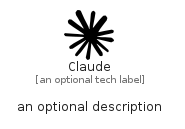

# Claude


```text
simpleicons-14/C/Claude
```

```text
include('simpleicons-14/C/Claude')
```


| Illustration | Claude |
| :---: | :---: |
|  |  |


## Sprites
The item provides the following sriptes:

- `<$ClaudeXs>`
- `<$ClaudeSm>`
- `<$ClaudeMd>`
- `<$ClaudeLg>`


## Claude

### Load remotely
```plantuml
@startuml
' configures the library
!global $LIB_BASE_LOCATION="https://raw.githubusercontent.com/tmorin/plantuml-libs/master/distribution"

' loads the library's bootstrap
!include $LIB_BASE_LOCATION/bootstrap.puml

' loads the package bootstrap
include('simpleicons-14/bootstrap')

' loads the Item which embeds the element Claude
include('simpleicons-14/C/Claude')

' renders the element
Claude('Claude', 'Claude', 'an optional tech label', 'an optional description')
@enduml
```

### Load locally
```plantuml
@startuml
' configures the library
!global $INCLUSION_MODE="local"
!global $LIB_BASE_LOCATION="../.."

' loads the library's bootstrap
!include $LIB_BASE_LOCATION/bootstrap.puml

' loads the package bootstrap
include('simpleicons-14/bootstrap')

' loads the Item which embeds the element Claude
include('simpleicons-14/C/Claude')

' renders the element
Claude('Claude', 'Claude', 'an optional tech label', 'an optional description')
@enduml
```

