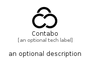

# Contabo


```text
simpleicons-14/C/Contabo
```

```text
include('simpleicons-14/C/Contabo')
```


| Illustration | Contabo |
| :---: | :---: |
|  |  |


## Sprites
The item provides the following sriptes:

- `<$ContaboXs>`
- `<$ContaboSm>`
- `<$ContaboMd>`
- `<$ContaboLg>`


## Contabo

### Load remotely
```plantuml
@startuml
' configures the library
!global $LIB_BASE_LOCATION="https://raw.githubusercontent.com/tmorin/plantuml-libs/master/distribution"

' loads the library's bootstrap
!include $LIB_BASE_LOCATION/bootstrap.puml

' loads the package bootstrap
include('simpleicons-14/bootstrap')

' loads the Item which embeds the element Contabo
include('simpleicons-14/C/Contabo')

' renders the element
Contabo('Contabo', 'Contabo', 'an optional tech label', 'an optional description')
@enduml
```

### Load locally
```plantuml
@startuml
' configures the library
!global $INCLUSION_MODE="local"
!global $LIB_BASE_LOCATION="../.."

' loads the library's bootstrap
!include $LIB_BASE_LOCATION/bootstrap.puml

' loads the package bootstrap
include('simpleicons-14/bootstrap')

' loads the Item which embeds the element Contabo
include('simpleicons-14/C/Contabo')

' renders the element
Contabo('Contabo', 'Contabo', 'an optional tech label', 'an optional description')
@enduml
```

