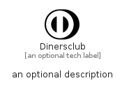

# Dinersclub


```text
simpleicons-14/D/Dinersclub
```

```text
include('simpleicons-14/D/Dinersclub')
```


| Illustration | Dinersclub |
| :---: | :---: |
|  |  |


## Sprites
The item provides the following sriptes:

- `<$DinersclubXs>`
- `<$DinersclubSm>`
- `<$DinersclubMd>`
- `<$DinersclubLg>`


## Dinersclub

### Load remotely
```plantuml
@startuml
' configures the library
!global $LIB_BASE_LOCATION="https://raw.githubusercontent.com/tmorin/plantuml-libs/master/distribution"

' loads the library's bootstrap
!include $LIB_BASE_LOCATION/bootstrap.puml

' loads the package bootstrap
include('simpleicons-14/bootstrap')

' loads the Item which embeds the element Dinersclub
include('simpleicons-14/D/Dinersclub')

' renders the element
Dinersclub('Dinersclub', 'Dinersclub', 'an optional tech label', 'an optional description')
@enduml
```

### Load locally
```plantuml
@startuml
' configures the library
!global $INCLUSION_MODE="local"
!global $LIB_BASE_LOCATION="../.."

' loads the library's bootstrap
!include $LIB_BASE_LOCATION/bootstrap.puml

' loads the package bootstrap
include('simpleicons-14/bootstrap')

' loads the Item which embeds the element Dinersclub
include('simpleicons-14/D/Dinersclub')

' renders the element
Dinersclub('Dinersclub', 'Dinersclub', 'an optional tech label', 'an optional description')
@enduml
```

