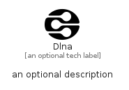

# Dlna


```text
simpleicons-14/D/Dlna
```

```text
include('simpleicons-14/D/Dlna')
```


| Illustration | Dlna |
| :---: | :---: |
|  |  |


## Sprites
The item provides the following sriptes:

- `<$DlnaXs>`
- `<$DlnaSm>`
- `<$DlnaMd>`
- `<$DlnaLg>`


## Dlna

### Load remotely
```plantuml
@startuml
' configures the library
!global $LIB_BASE_LOCATION="https://raw.githubusercontent.com/tmorin/plantuml-libs/master/distribution"

' loads the library's bootstrap
!include $LIB_BASE_LOCATION/bootstrap.puml

' loads the package bootstrap
include('simpleicons-14/bootstrap')

' loads the Item which embeds the element Dlna
include('simpleicons-14/D/Dlna')

' renders the element
Dlna('Dlna', 'Dlna', 'an optional tech label', 'an optional description')
@enduml
```

### Load locally
```plantuml
@startuml
' configures the library
!global $INCLUSION_MODE="local"
!global $LIB_BASE_LOCATION="../.."

' loads the library's bootstrap
!include $LIB_BASE_LOCATION/bootstrap.puml

' loads the package bootstrap
include('simpleicons-14/bootstrap')

' loads the Item which embeds the element Dlna
include('simpleicons-14/D/Dlna')

' renders the element
Dlna('Dlna', 'Dlna', 'an optional tech label', 'an optional description')
@enduml
```

