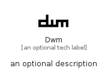

# Dwm


```text
simpleicons-14/D/Dwm
```

```text
include('simpleicons-14/D/Dwm')
```


| Illustration | Dwm |
| :---: | :---: |
|  |  |


## Sprites
The item provides the following sriptes:

- `<$DwmXs>`
- `<$DwmSm>`
- `<$DwmMd>`
- `<$DwmLg>`


## Dwm

### Load remotely
```plantuml
@startuml
' configures the library
!global $LIB_BASE_LOCATION="https://raw.githubusercontent.com/tmorin/plantuml-libs/master/distribution"

' loads the library's bootstrap
!include $LIB_BASE_LOCATION/bootstrap.puml

' loads the package bootstrap
include('simpleicons-14/bootstrap')

' loads the Item which embeds the element Dwm
include('simpleicons-14/D/Dwm')

' renders the element
Dwm('Dwm', 'Dwm', 'an optional tech label', 'an optional description')
@enduml
```

### Load locally
```plantuml
@startuml
' configures the library
!global $INCLUSION_MODE="local"
!global $LIB_BASE_LOCATION="../.."

' loads the library's bootstrap
!include $LIB_BASE_LOCATION/bootstrap.puml

' loads the package bootstrap
include('simpleicons-14/bootstrap')

' loads the Item which embeds the element Dwm
include('simpleicons-14/D/Dwm')

' renders the element
Dwm('Dwm', 'Dwm', 'an optional tech label', 'an optional description')
@enduml
```

