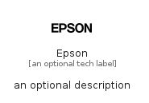

# Epson


```text
simpleicons-14/E/Epson
```

```text
include('simpleicons-14/E/Epson')
```


| Illustration | Epson |
| :---: | :---: |
|  |  |


## Sprites
The item provides the following sriptes:

- `<$EpsonXs>`
- `<$EpsonSm>`
- `<$EpsonMd>`
- `<$EpsonLg>`


## Epson

### Load remotely
```plantuml
@startuml
' configures the library
!global $LIB_BASE_LOCATION="https://raw.githubusercontent.com/tmorin/plantuml-libs/master/distribution"

' loads the library's bootstrap
!include $LIB_BASE_LOCATION/bootstrap.puml

' loads the package bootstrap
include('simpleicons-14/bootstrap')

' loads the Item which embeds the element Epson
include('simpleicons-14/E/Epson')

' renders the element
Epson('Epson', 'Epson', 'an optional tech label', 'an optional description')
@enduml
```

### Load locally
```plantuml
@startuml
' configures the library
!global $INCLUSION_MODE="local"
!global $LIB_BASE_LOCATION="../.."

' loads the library's bootstrap
!include $LIB_BASE_LOCATION/bootstrap.puml

' loads the package bootstrap
include('simpleicons-14/bootstrap')

' loads the Item which embeds the element Epson
include('simpleicons-14/E/Epson')

' renders the element
Epson('Epson', 'Epson', 'an optional tech label', 'an optional description')
@enduml
```

