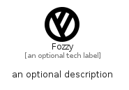

# Fozzy


```text
simpleicons-14/F/Fozzy
```

```text
include('simpleicons-14/F/Fozzy')
```


| Illustration | Fozzy |
| :---: | :---: |
|  |  |


## Sprites
The item provides the following sriptes:

- `<$FozzyXs>`
- `<$FozzySm>`
- `<$FozzyMd>`
- `<$FozzyLg>`


## Fozzy

### Load remotely
```plantuml
@startuml
' configures the library
!global $LIB_BASE_LOCATION="https://raw.githubusercontent.com/tmorin/plantuml-libs/master/distribution"

' loads the library's bootstrap
!include $LIB_BASE_LOCATION/bootstrap.puml

' loads the package bootstrap
include('simpleicons-14/bootstrap')

' loads the Item which embeds the element Fozzy
include('simpleicons-14/F/Fozzy')

' renders the element
Fozzy('Fozzy', 'Fozzy', 'an optional tech label', 'an optional description')
@enduml
```

### Load locally
```plantuml
@startuml
' configures the library
!global $INCLUSION_MODE="local"
!global $LIB_BASE_LOCATION="../.."

' loads the library's bootstrap
!include $LIB_BASE_LOCATION/bootstrap.puml

' loads the package bootstrap
include('simpleicons-14/bootstrap')

' loads the Item which embeds the element Fozzy
include('simpleicons-14/F/Fozzy')

' renders the element
Fozzy('Fozzy', 'Fozzy', 'an optional tech label', 'an optional description')
@enduml
```

