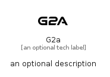

# G2A


```text
simpleicons-14/G/G2A
```

```text
include('simpleicons-14/G/G2A')
```


| Illustration | G2A |
| :---: | :---: |
|  |  |


## Sprites
The item provides the following sriptes:

- `<$G2AXs>`
- `<$G2ASm>`
- `<$G2AMd>`
- `<$G2ALg>`


## G2A

### Load remotely
```plantuml
@startuml
' configures the library
!global $LIB_BASE_LOCATION="https://raw.githubusercontent.com/tmorin/plantuml-libs/master/distribution"

' loads the library's bootstrap
!include $LIB_BASE_LOCATION/bootstrap.puml

' loads the package bootstrap
include('simpleicons-14/bootstrap')

' loads the Item which embeds the element G2A
include('simpleicons-14/G/G2A')

' renders the element
G2A('G2a', 'G2a', 'an optional tech label', 'an optional description')
@enduml
```

### Load locally
```plantuml
@startuml
' configures the library
!global $INCLUSION_MODE="local"
!global $LIB_BASE_LOCATION="../.."

' loads the library's bootstrap
!include $LIB_BASE_LOCATION/bootstrap.puml

' loads the package bootstrap
include('simpleicons-14/bootstrap')

' loads the Item which embeds the element G2A
include('simpleicons-14/G/G2A')

' renders the element
G2A('G2a', 'G2a', 'an optional tech label', 'an optional description')
@enduml
```

