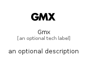

# Gmx


```text
simpleicons-14/G/Gmx
```

```text
include('simpleicons-14/G/Gmx')
```


| Illustration | Gmx |
| :---: | :---: |
|  |  |


## Sprites
The item provides the following sriptes:

- `<$GmxXs>`
- `<$GmxSm>`
- `<$GmxMd>`
- `<$GmxLg>`


## Gmx

### Load remotely
```plantuml
@startuml
' configures the library
!global $LIB_BASE_LOCATION="https://raw.githubusercontent.com/tmorin/plantuml-libs/master/distribution"

' loads the library's bootstrap
!include $LIB_BASE_LOCATION/bootstrap.puml

' loads the package bootstrap
include('simpleicons-14/bootstrap')

' loads the Item which embeds the element Gmx
include('simpleicons-14/G/Gmx')

' renders the element
Gmx('Gmx', 'Gmx', 'an optional tech label', 'an optional description')
@enduml
```

### Load locally
```plantuml
@startuml
' configures the library
!global $INCLUSION_MODE="local"
!global $LIB_BASE_LOCATION="../.."

' loads the library's bootstrap
!include $LIB_BASE_LOCATION/bootstrap.puml

' loads the package bootstrap
include('simpleicons-14/bootstrap')

' loads the Item which embeds the element Gmx
include('simpleicons-14/G/Gmx')

' renders the element
Gmx('Gmx', 'Gmx', 'an optional tech label', 'an optional description')
@enduml
```

