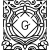

# G

The module contains 182 items.

| |Name|
|:---:|---|
|  | [simpleicons-14/G/G2](../../simpleicons-14/G/G2.md) |
|  | [simpleicons-14/G/G2A](../../simpleicons-14/G/G2A.md) |
|  | [simpleicons-14/G/G2G](../../simpleicons-14/G/G2G.md) |
|  | [simpleicons-14/G/Galaxus](../../simpleicons-14/G/Galaxus.md) |
|  | [simpleicons-14/G/Gamebanana](../../simpleicons-14/G/Gamebanana.md) |
|  | [simpleicons-14/G/Gamedeveloper](../../simpleicons-14/G/Gamedeveloper.md) |
|  | [simpleicons-14/G/Gamejolt](../../simpleicons-14/G/Gamejolt.md) |
|  | [simpleicons-14/G/Gameloft](../../simpleicons-14/G/Gameloft.md) |
|  | [simpleicons-14/G/Gamemaker](../../simpleicons-14/G/Gamemaker.md) |
|  | [simpleicons-14/G/Gamescience](../../simpleicons-14/G/Gamescience.md) |
|  | [simpleicons-14/G/Gandi](../../simpleicons-14/G/Gandi.md) |
|  | [simpleicons-14/G/Garmin](../../simpleicons-14/G/Garmin.md) |
|  | [simpleicons-14/G/Garudalinux](../../simpleicons-14/G/Garudalinux.md) |
|  | [simpleicons-14/G/Gatling](../../simpleicons-14/G/Gatling.md) |
|  | [simpleicons-14/G/Gatsby](../../simpleicons-14/G/Gatsby.md) |
|  | [simpleicons-14/G/Gcore](../../simpleicons-14/G/Gcore.md) |
|  | [simpleicons-14/G/Gdal](../../simpleicons-14/G/Gdal.md) |
|  | [simpleicons-14/G/Geeksforgeeks](../../simpleicons-14/G/Geeksforgeeks.md) |
|  | [simpleicons-14/G/Generalelectric](../../simpleicons-14/G/Generalelectric.md) |
|  | [simpleicons-14/G/Generalmotors](../../simpleicons-14/G/Generalmotors.md) |
|  | [simpleicons-14/G/Genius](../../simpleicons-14/G/Genius.md) |
|  | [simpleicons-14/G/Gentoo](../../simpleicons-14/G/Gentoo.md) |
|  | [simpleicons-14/G/Geocaching](../../simpleicons-14/G/Geocaching.md) |
|  | [simpleicons-14/G/Geode](../../simpleicons-14/G/Geode.md) |
|  | [simpleicons-14/G/Geopandas](../../simpleicons-14/G/Geopandas.md) |
|  | [simpleicons-14/G/Gerrit](../../simpleicons-14/G/Gerrit.md) |
|  | [simpleicons-14/G/Getx](../../simpleicons-14/G/Getx.md) |
|  | [simpleicons-14/G/Ghost](../../simpleicons-14/G/Ghost.md) |
|  | [simpleicons-14/G/Ghostery](../../simpleicons-14/G/Ghostery.md) |
|  | [simpleicons-14/G/Ghostty](../../simpleicons-14/G/Ghostty.md) |
|  | [simpleicons-14/G/Gimp](../../simpleicons-14/G/Gimp.md) |
|  | [simpleicons-14/G/Gin](../../simpleicons-14/G/Gin.md) |
|  | [simpleicons-14/G/Giphy](../../simpleicons-14/G/Giphy.md) |
|  | [simpleicons-14/G/Git](../../simpleicons-14/G/Git.md) |
|  | [simpleicons-14/G/Gitbook](../../simpleicons-14/G/Gitbook.md) |
|  | [simpleicons-14/G/Gitcode](../../simpleicons-14/G/Gitcode.md) |
|  | [simpleicons-14/G/Gitconnected](../../simpleicons-14/G/Gitconnected.md) |
|  | [simpleicons-14/G/Gitea](../../simpleicons-14/G/Gitea.md) |
|  | [simpleicons-14/G/Gitee](../../simpleicons-14/G/Gitee.md) |
|  | [simpleicons-14/G/Gitextensions](../../simpleicons-14/G/Gitextensions.md) |
|  | [simpleicons-14/G/Gitforwindows](../../simpleicons-14/G/Gitforwindows.md) |
|  | [simpleicons-14/G/Github](../../simpleicons-14/G/Github.md) |
|  | [simpleicons-14/G/Githubactions](../../simpleicons-14/G/Githubactions.md) |
|  | [simpleicons-14/G/Githubcopilot](../../simpleicons-14/G/Githubcopilot.md) |
|  | [simpleicons-14/G/Githubpages](../../simpleicons-14/G/Githubpages.md) |
|  | [simpleicons-14/G/Githubsponsors](../../simpleicons-14/G/Githubsponsors.md) |
|  | [simpleicons-14/G/Gitignoredotio](../../simpleicons-14/G/Gitignoredotio.md) |
|  | [simpleicons-14/G/Gitkraken](../../simpleicons-14/G/Gitkraken.md) |
|  | [simpleicons-14/G/Gitlab](../../simpleicons-14/G/Gitlab.md) |
|  | [simpleicons-14/G/Gitlfs](../../simpleicons-14/G/Gitlfs.md) |
|  | [simpleicons-14/G/Gitpod](../../simpleicons-14/G/Gitpod.md) |
|  | [simpleicons-14/G/Gitter](../../simpleicons-14/G/Gitter.md) |
|  | [simpleicons-14/G/Glance](../../simpleicons-14/G/Glance.md) |
|  | [simpleicons-14/G/Glassdoor](../../simpleicons-14/G/Glassdoor.md) |
|  | [simpleicons-14/G/Gldotinet](../../simpleicons-14/G/Gldotinet.md) |
|  | [simpleicons-14/G/Gleam](../../simpleicons-14/G/Gleam.md) |
|  | [simpleicons-14/G/Glide](../../simpleicons-14/G/Glide.md) |
|  | [simpleicons-14/G/Glitch](../../simpleicons-14/G/Glitch.md) |
|  | [simpleicons-14/G/Globus](../../simpleicons-14/G/Globus.md) |
|  | [simpleicons-14/G/Glovo](../../simpleicons-14/G/Glovo.md) |
|  | [simpleicons-14/G/Gltf](../../simpleicons-14/G/Gltf.md) |
|  | [simpleicons-14/G/Gmail](../../simpleicons-14/G/Gmail.md) |
|  | [simpleicons-14/G/Gmx](../../simpleicons-14/G/Gmx.md) |
|  | [simpleicons-14/G/Gnome](../../simpleicons-14/G/Gnome.md) |
|  | [simpleicons-14/G/Gnometerminal](../../simpleicons-14/G/Gnometerminal.md) |
|  | [simpleicons-14/G/Gnu](../../simpleicons-14/G/Gnu.md) |
|  | [simpleicons-14/G/Gnubash](../../simpleicons-14/G/Gnubash.md) |
|  | [simpleicons-14/G/Gnuemacs](../../simpleicons-14/G/Gnuemacs.md) |
|  | [simpleicons-14/G/Gnuicecat](../../simpleicons-14/G/Gnuicecat.md) |
|  | [simpleicons-14/G/Gnuprivacyguard](../../simpleicons-14/G/Gnuprivacyguard.md) |
|  | [simpleicons-14/G/Gnusocial](../../simpleicons-14/G/Gnusocial.md) |
|  | [simpleicons-14/G/Go](../../simpleicons-14/G/Go.md) |
|  | [simpleicons-14/G/Gocd](../../simpleicons-14/G/Gocd.md) |
|  | [simpleicons-14/G/Godaddy](../../simpleicons-14/G/Godaddy.md) |
|  | [simpleicons-14/G/Godotengine](../../simpleicons-14/G/Godotengine.md) |
|  | [simpleicons-14/G/Gofundme](../../simpleicons-14/G/Gofundme.md) |
|  | [simpleicons-14/G/Gogdotcom](../../simpleicons-14/G/Gogdotcom.md) |
|  | [simpleicons-14/G/Gojek](../../simpleicons-14/G/Gojek.md) |
|  | [simpleicons-14/G/Goland](../../simpleicons-14/G/Goland.md) |
|  | [simpleicons-14/G/Goldmansachs](../../simpleicons-14/G/Goldmansachs.md) |
|  | [simpleicons-14/G/Goodreads](../../simpleicons-14/G/Goodreads.md) |
|  | [simpleicons-14/G/Google](../../simpleicons-14/G/Google.md) |
|  | [simpleicons-14/G/Googleadmob](../../simpleicons-14/G/Googleadmob.md) |
|  | [simpleicons-14/G/Googleads](../../simpleicons-14/G/Googleads.md) |
|  | [simpleicons-14/G/Googleadsense](../../simpleicons-14/G/Googleadsense.md) |
|  | [simpleicons-14/G/Googleanalytics](../../simpleicons-14/G/Googleanalytics.md) |
|  | [simpleicons-14/G/Googleappsscript](../../simpleicons-14/G/Googleappsscript.md) |
|  | [simpleicons-14/G/Googleassistant](../../simpleicons-14/G/Googleassistant.md) |
|  | [simpleicons-14/G/Googleauthenticator](../../simpleicons-14/G/Googleauthenticator.md) |
|  | [simpleicons-14/G/Googlebigquery](../../simpleicons-14/G/Googlebigquery.md) |
|  | [simpleicons-14/G/Googlebigtable](../../simpleicons-14/G/Googlebigtable.md) |
|  | [simpleicons-14/G/Googlecalendar](../../simpleicons-14/G/Googlecalendar.md) |
|  | [simpleicons-14/G/Googlecampaignmanager360](../../simpleicons-14/G/Googlecampaignmanager360.md) |
|  | [simpleicons-14/G/Googlecardboard](../../simpleicons-14/G/Googlecardboard.md) |
|  | [simpleicons-14/G/Googlecast](../../simpleicons-14/G/Googlecast.md) |
|  | [simpleicons-14/G/Googlechat](../../simpleicons-14/G/Googlechat.md) |
|  | [simpleicons-14/G/Googlechrome](../../simpleicons-14/G/Googlechrome.md) |
|  | [simpleicons-14/G/Googlechronicle](../../simpleicons-14/G/Googlechronicle.md) |
|  | [simpleicons-14/G/Googleclassroom](../../simpleicons-14/G/Googleclassroom.md) |
|  | [simpleicons-14/G/Googlecloud](../../simpleicons-14/G/Googlecloud.md) |
|  | [simpleicons-14/G/Googlecloudcomposer](../../simpleicons-14/G/Googlecloudcomposer.md) |
|  | [simpleicons-14/G/Googlecloudspanner](../../simpleicons-14/G/Googlecloudspanner.md) |
|  | [simpleicons-14/G/Googlecloudstorage](../../simpleicons-14/G/Googlecloudstorage.md) |
|  | [simpleicons-14/G/Googlecolab](../../simpleicons-14/G/Googlecolab.md) |
|  | [simpleicons-14/G/Googlecontaineroptimizedos](../../simpleicons-14/G/Googlecontaineroptimizedos.md) |
|  | [simpleicons-14/G/Googledataflow](../../simpleicons-14/G/Googledataflow.md) |
|  | [simpleicons-14/G/Googledataproc](../../simpleicons-14/G/Googledataproc.md) |
|  | [simpleicons-14/G/Googledisplayandvideo360](../../simpleicons-14/G/Googledisplayandvideo360.md) |
|  | [simpleicons-14/G/Googledocs](../../simpleicons-14/G/Googledocs.md) |
|  | [simpleicons-14/G/Googledrive](../../simpleicons-14/G/Googledrive.md) |
|  | [simpleicons-14/G/Googleearth](../../simpleicons-14/G/Googleearth.md) |
|  | [simpleicons-14/G/Googleearthengine](../../simpleicons-14/G/Googleearthengine.md) |
|  | [simpleicons-14/G/Googlefonts](../../simpleicons-14/G/Googlefonts.md) |
|  | [simpleicons-14/G/Googleforms](../../simpleicons-14/G/Googleforms.md) |
|  | [simpleicons-14/G/Googlegemini](../../simpleicons-14/G/Googlegemini.md) |
|  | [simpleicons-14/G/Googlehome](../../simpleicons-14/G/Googlehome.md) |
|  | [simpleicons-14/G/Googlejules](../../simpleicons-14/G/Googlejules.md) |
|  | [simpleicons-14/G/Googlekeep](../../simpleicons-14/G/Googlekeep.md) |
|  | [simpleicons-14/G/Googlelens](../../simpleicons-14/G/Googlelens.md) |
|  | [simpleicons-14/G/Googlemaps](../../simpleicons-14/G/Googlemaps.md) |
|  | [simpleicons-14/G/Googlemarketingplatform](../../simpleicons-14/G/Googlemarketingplatform.md) |
|  | [simpleicons-14/G/Googlemeet](../../simpleicons-14/G/Googlemeet.md) |
|  | [simpleicons-14/G/Googlemessages](../../simpleicons-14/G/Googlemessages.md) |
|  | [simpleicons-14/G/Googlenearby](../../simpleicons-14/G/Googlenearby.md) |
|  | [simpleicons-14/G/Googlenews](../../simpleicons-14/G/Googlenews.md) |
|  | [simpleicons-14/G/Googlepay](../../simpleicons-14/G/Googlepay.md) |
|  | [simpleicons-14/G/Googlephotos](../../simpleicons-14/G/Googlephotos.md) |
|  | [simpleicons-14/G/Googleplay](../../simpleicons-14/G/Googleplay.md) |
|  | [simpleicons-14/G/Googlepubsub](../../simpleicons-14/G/Googlepubsub.md) |
|  | [simpleicons-14/G/Googlescholar](../../simpleicons-14/G/Googlescholar.md) |
|  | [simpleicons-14/G/Googlesearchconsole](../../simpleicons-14/G/Googlesearchconsole.md) |
|  | [simpleicons-14/G/Googlesheets](../../simpleicons-14/G/Googlesheets.md) |
|  | [simpleicons-14/G/Googleslides](../../simpleicons-14/G/Googleslides.md) |
|  | [simpleicons-14/G/Googlestreetview](../../simpleicons-14/G/Googlestreetview.md) |
|  | [simpleicons-14/G/Googlesummerofcode](../../simpleicons-14/G/Googlesummerofcode.md) |
|  | [simpleicons-14/G/Googletagmanager](../../simpleicons-14/G/Googletagmanager.md) |
|  | [simpleicons-14/G/Googletasks](../../simpleicons-14/G/Googletasks.md) |
|  | [simpleicons-14/G/Googletranslate](../../simpleicons-14/G/Googletranslate.md) |
|  | [simpleicons-14/G/Googletv](../../simpleicons-14/G/Googletv.md) |
|  | [simpleicons-14/G/Gotomeeting](../../simpleicons-14/G/Gotomeeting.md) |
|  | [simpleicons-14/G/Gplv3](../../simpleicons-14/G/Gplv3.md) |
|  | [simpleicons-14/G/Grab](../../simpleicons-14/G/Grab.md) |
|  | [simpleicons-14/G/Gradio](../../simpleicons-14/G/Gradio.md) |
|  | [simpleicons-14/G/Gradle](../../simpleicons-14/G/Gradle.md) |
|  | [simpleicons-14/G/Gradleplaypublisher](../../simpleicons-14/G/Gradleplaypublisher.md) |
|  | [simpleicons-14/G/Grafana](../../simpleicons-14/G/Grafana.md) |
|  | [simpleicons-14/G/Grammarly](../../simpleicons-14/G/Grammarly.md) |
|  | [simpleicons-14/G/Grandfrais](../../simpleicons-14/G/Grandfrais.md) |
|  | [simpleicons-14/G/Grapheneos](../../simpleicons-14/G/Grapheneos.md) |
|  | [simpleicons-14/G/Graphite](../../simpleicons-14/G/Graphite.md) |
|  | [simpleicons-14/G/GraphiteEditor](../../simpleicons-14/G/GraphiteEditor.md) |
|  | [simpleicons-14/G/Graphql](../../simpleicons-14/G/Graphql.md) |
|  | [simpleicons-14/G/Grav](../../simpleicons-14/G/Grav.md) |
|  | [simpleicons-14/G/Gravatar](../../simpleicons-14/G/Gravatar.md) |
|  | [simpleicons-14/G/Graylog](../../simpleicons-14/G/Graylog.md) |
|  | [simpleicons-14/G/Greasyfork](../../simpleicons-14/G/Greasyfork.md) |
|  | [simpleicons-14/G/Greatlearning](../../simpleicons-14/G/Greatlearning.md) |
|  | [simpleicons-14/G/Greenhouse](../../simpleicons-14/G/Greenhouse.md) |
|  | [simpleicons-14/G/Greensock](../../simpleicons-14/G/Greensock.md) |
|  | [simpleicons-14/G/Greptimedb](../../simpleicons-14/G/Greptimedb.md) |
|  | [simpleicons-14/G/Griddotai](../../simpleicons-14/G/Griddotai.md) |
|  | [simpleicons-14/G/Gridsome](../../simpleicons-14/G/Gridsome.md) |
|  | [simpleicons-14/G/Grocy](../../simpleicons-14/G/Grocy.md) |
|  | [simpleicons-14/G/Groupme](../../simpleicons-14/G/Groupme.md) |
|  | [simpleicons-14/G/Groupon](../../simpleicons-14/G/Groupon.md) |
|  | [simpleicons-14/G/Grunt](../../simpleicons-14/G/Grunt.md) |
|  | [simpleicons-14/G/Gsap](../../simpleicons-14/G/Gsap.md) |
|  | [simpleicons-14/G/Gsk](../../simpleicons-14/G/Gsk.md) |
|  | [simpleicons-14/G/Gsma](../../simpleicons-14/G/Gsma.md) |
|  | [simpleicons-14/G/Gsmarenadotcom](../../simpleicons-14/G/Gsmarenadotcom.md) |
|  | [simpleicons-14/G/Gstreamer](../../simpleicons-14/G/Gstreamer.md) |
|  | [simpleicons-14/G/Gtk](../../simpleicons-14/G/Gtk.md) |
|  | [simpleicons-14/G/Guangzhoumetro](../../simpleicons-14/G/Guangzhoumetro.md) |
|  | [simpleicons-14/G/Guilded](../../simpleicons-14/G/Guilded.md) |
|  | [simpleicons-14/G/Guitarpro](../../simpleicons-14/G/Guitarpro.md) |
|  | [simpleicons-14/G/Gulp](../../simpleicons-14/G/Gulp.md) |
|  | [simpleicons-14/G/Gumroad](../../simpleicons-14/G/Gumroad.md) |
|  | [simpleicons-14/G/Gumtree](../../simpleicons-14/G/Gumtree.md) |
|  | [simpleicons-14/G/Gunicorn](../../simpleicons-14/G/Gunicorn.md) |
|  | [simpleicons-14/G/Gurobi](../../simpleicons-14/G/Gurobi.md) |
|  | [simpleicons-14/G/Gusto](../../simpleicons-14/G/Gusto.md) |
|  | [simpleicons-14/G/Gutenberg](../../simpleicons-14/G/Gutenberg.md) |

