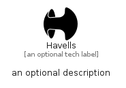

# Havells


```text
simpleicons-14/H/Havells
```

```text
include('simpleicons-14/H/Havells')
```


| Illustration | Havells |
| :---: | :---: |
|  |  |


## Sprites
The item provides the following sriptes:

- `<$HavellsXs>`
- `<$HavellsSm>`
- `<$HavellsMd>`
- `<$HavellsLg>`


## Havells

### Load remotely
```plantuml
@startuml
' configures the library
!global $LIB_BASE_LOCATION="https://raw.githubusercontent.com/tmorin/plantuml-libs/master/distribution"

' loads the library's bootstrap
!include $LIB_BASE_LOCATION/bootstrap.puml

' loads the package bootstrap
include('simpleicons-14/bootstrap')

' loads the Item which embeds the element Havells
include('simpleicons-14/H/Havells')

' renders the element
Havells('Havells', 'Havells', 'an optional tech label', 'an optional description')
@enduml
```

### Load locally
```plantuml
@startuml
' configures the library
!global $INCLUSION_MODE="local"
!global $LIB_BASE_LOCATION="../.."

' loads the library's bootstrap
!include $LIB_BASE_LOCATION/bootstrap.puml

' loads the package bootstrap
include('simpleicons-14/bootstrap')

' loads the Item which embeds the element Havells
include('simpleicons-14/H/Havells')

' renders the element
Havells('Havells', 'Havells', 'an optional tech label', 'an optional description')
@enduml
```

