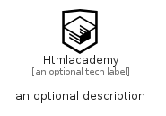

# Htmlacademy


```text
simpleicons-14/H/Htmlacademy
```

```text
include('simpleicons-14/H/Htmlacademy')
```


| Illustration | Htmlacademy |
| :---: | :---: |
|  |  |


## Sprites
The item provides the following sriptes:

- `<$HtmlacademyXs>`
- `<$HtmlacademySm>`
- `<$HtmlacademyMd>`
- `<$HtmlacademyLg>`


## Htmlacademy

### Load remotely
```plantuml
@startuml
' configures the library
!global $LIB_BASE_LOCATION="https://raw.githubusercontent.com/tmorin/plantuml-libs/master/distribution"

' loads the library's bootstrap
!include $LIB_BASE_LOCATION/bootstrap.puml

' loads the package bootstrap
include('simpleicons-14/bootstrap')

' loads the Item which embeds the element Htmlacademy
include('simpleicons-14/H/Htmlacademy')

' renders the element
Htmlacademy('Htmlacademy', 'Htmlacademy', 'an optional tech label', 'an optional description')
@enduml
```

### Load locally
```plantuml
@startuml
' configures the library
!global $INCLUSION_MODE="local"
!global $LIB_BASE_LOCATION="../.."

' loads the library's bootstrap
!include $LIB_BASE_LOCATION/bootstrap.puml

' loads the package bootstrap
include('simpleicons-14/bootstrap')

' loads the Item which embeds the element Htmlacademy
include('simpleicons-14/H/Htmlacademy')

' renders the element
Htmlacademy('Htmlacademy', 'Htmlacademy', 'an optional tech label', 'an optional description')
@enduml
```

