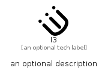

# I3


```text
simpleicons-14/I/I3
```

```text
include('simpleicons-14/I/I3')
```


| Illustration | I3 |
| :---: | :---: |
|  |  |


## Sprites
The item provides the following sriptes:

- `<$I3Xs>`
- `<$I3Sm>`
- `<$I3Md>`
- `<$I3Lg>`


## I3

### Load remotely
```plantuml
@startuml
' configures the library
!global $LIB_BASE_LOCATION="https://raw.githubusercontent.com/tmorin/plantuml-libs/master/distribution"

' loads the library's bootstrap
!include $LIB_BASE_LOCATION/bootstrap.puml

' loads the package bootstrap
include('simpleicons-14/bootstrap')

' loads the Item which embeds the element I3
include('simpleicons-14/I/I3')

' renders the element
I3('I3', 'I3', 'an optional tech label', 'an optional description')
@enduml
```

### Load locally
```plantuml
@startuml
' configures the library
!global $INCLUSION_MODE="local"
!global $LIB_BASE_LOCATION="../.."

' loads the library's bootstrap
!include $LIB_BASE_LOCATION/bootstrap.puml

' loads the package bootstrap
include('simpleicons-14/bootstrap')

' loads the Item which embeds the element I3
include('simpleicons-14/I/I3')

' renders the element
I3('I3', 'I3', 'an optional tech label', 'an optional description')
@enduml
```

