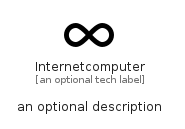

# Internetcomputer


```text
simpleicons-14/I/Internetcomputer
```

```text
include('simpleicons-14/I/Internetcomputer')
```


| Illustration | Internetcomputer |
| :---: | :---: |
|  |  |


## Sprites
The item provides the following sriptes:

- `<$InternetcomputerXs>`
- `<$InternetcomputerSm>`
- `<$InternetcomputerMd>`
- `<$InternetcomputerLg>`


## Internetcomputer

### Load remotely
```plantuml
@startuml
' configures the library
!global $LIB_BASE_LOCATION="https://raw.githubusercontent.com/tmorin/plantuml-libs/master/distribution"

' loads the library's bootstrap
!include $LIB_BASE_LOCATION/bootstrap.puml

' loads the package bootstrap
include('simpleicons-14/bootstrap')

' loads the Item which embeds the element Internetcomputer
include('simpleicons-14/I/Internetcomputer')

' renders the element
Internetcomputer('Internetcomputer', 'Internetcomputer', 'an optional tech label', 'an optional description')
@enduml
```

### Load locally
```plantuml
@startuml
' configures the library
!global $INCLUSION_MODE="local"
!global $LIB_BASE_LOCATION="../.."

' loads the library's bootstrap
!include $LIB_BASE_LOCATION/bootstrap.puml

' loads the package bootstrap
include('simpleicons-14/bootstrap')

' loads the Item which embeds the element Internetcomputer
include('simpleicons-14/I/Internetcomputer')

' renders the element
Internetcomputer('Internetcomputer', 'Internetcomputer', 'an optional tech label', 'an optional description')
@enduml
```

