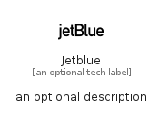

# Jetblue


```text
simpleicons-14/J/Jetblue
```

```text
include('simpleicons-14/J/Jetblue')
```


| Illustration | Jetblue |
| :---: | :---: |
|  |  |


## Sprites
The item provides the following sriptes:

- `<$JetblueXs>`
- `<$JetblueSm>`
- `<$JetblueMd>`
- `<$JetblueLg>`


## Jetblue

### Load remotely
```plantuml
@startuml
' configures the library
!global $LIB_BASE_LOCATION="https://raw.githubusercontent.com/tmorin/plantuml-libs/master/distribution"

' loads the library's bootstrap
!include $LIB_BASE_LOCATION/bootstrap.puml

' loads the package bootstrap
include('simpleicons-14/bootstrap')

' loads the Item which embeds the element Jetblue
include('simpleicons-14/J/Jetblue')

' renders the element
Jetblue('Jetblue', 'Jetblue', 'an optional tech label', 'an optional description')
@enduml
```

### Load locally
```plantuml
@startuml
' configures the library
!global $INCLUSION_MODE="local"
!global $LIB_BASE_LOCATION="../.."

' loads the library's bootstrap
!include $LIB_BASE_LOCATION/bootstrap.puml

' loads the package bootstrap
include('simpleicons-14/bootstrap')

' loads the Item which embeds the element Jetblue
include('simpleicons-14/J/Jetblue')

' renders the element
Jetblue('Jetblue', 'Jetblue', 'an optional tech label', 'an optional description')
@enduml
```

