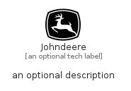

# Johndeere


```text
simpleicons-14/J/Johndeere
```

```text
include('simpleicons-14/J/Johndeere')
```


| Illustration | Johndeere |
| :---: | :---: |
|  |  |


## Sprites
The item provides the following sriptes:

- `<$JohndeereXs>`
- `<$JohndeereSm>`
- `<$JohndeereMd>`
- `<$JohndeereLg>`


## Johndeere

### Load remotely
```plantuml
@startuml
' configures the library
!global $LIB_BASE_LOCATION="https://raw.githubusercontent.com/tmorin/plantuml-libs/master/distribution"

' loads the library's bootstrap
!include $LIB_BASE_LOCATION/bootstrap.puml

' loads the package bootstrap
include('simpleicons-14/bootstrap')

' loads the Item which embeds the element Johndeere
include('simpleicons-14/J/Johndeere')

' renders the element
Johndeere('Johndeere', 'Johndeere', 'an optional tech label', 'an optional description')
@enduml
```

### Load locally
```plantuml
@startuml
' configures the library
!global $INCLUSION_MODE="local"
!global $LIB_BASE_LOCATION="../.."

' loads the library's bootstrap
!include $LIB_BASE_LOCATION/bootstrap.puml

' loads the package bootstrap
include('simpleicons-14/bootstrap')

' loads the Item which embeds the element Johndeere
include('simpleicons-14/J/Johndeere')

' renders the element
Johndeere('Johndeere', 'Johndeere', 'an optional tech label', 'an optional description')
@enduml
```

