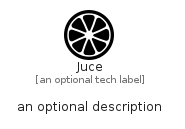

# Juce


```text
simpleicons-14/J/Juce
```

```text
include('simpleicons-14/J/Juce')
```


| Illustration | Juce |
| :---: | :---: |
|  |  |


## Sprites
The item provides the following sriptes:

- `<$JuceXs>`
- `<$JuceSm>`
- `<$JuceMd>`
- `<$JuceLg>`


## Juce

### Load remotely
```plantuml
@startuml
' configures the library
!global $LIB_BASE_LOCATION="https://raw.githubusercontent.com/tmorin/plantuml-libs/master/distribution"

' loads the library's bootstrap
!include $LIB_BASE_LOCATION/bootstrap.puml

' loads the package bootstrap
include('simpleicons-14/bootstrap')

' loads the Item which embeds the element Juce
include('simpleicons-14/J/Juce')

' renders the element
Juce('Juce', 'Juce', 'an optional tech label', 'an optional description')
@enduml
```

### Load locally
```plantuml
@startuml
' configures the library
!global $INCLUSION_MODE="local"
!global $LIB_BASE_LOCATION="../.."

' loads the library's bootstrap
!include $LIB_BASE_LOCATION/bootstrap.puml

' loads the package bootstrap
include('simpleicons-14/bootstrap')

' loads the Item which embeds the element Juce
include('simpleicons-14/J/Juce')

' renders the element
Juce('Juce', 'Juce', 'an optional tech label', 'an optional description')
@enduml
```

