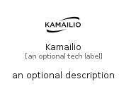

# Kamailio


```text
simpleicons-14/K/Kamailio
```

```text
include('simpleicons-14/K/Kamailio')
```


| Illustration | Kamailio |
| :---: | :---: |
|  |  |


## Sprites
The item provides the following sriptes:

- `<$KamailioXs>`
- `<$KamailioSm>`
- `<$KamailioMd>`
- `<$KamailioLg>`


## Kamailio

### Load remotely
```plantuml
@startuml
' configures the library
!global $LIB_BASE_LOCATION="https://raw.githubusercontent.com/tmorin/plantuml-libs/master/distribution"

' loads the library's bootstrap
!include $LIB_BASE_LOCATION/bootstrap.puml

' loads the package bootstrap
include('simpleicons-14/bootstrap')

' loads the Item which embeds the element Kamailio
include('simpleicons-14/K/Kamailio')

' renders the element
Kamailio('Kamailio', 'Kamailio', 'an optional tech label', 'an optional description')
@enduml
```

### Load locally
```plantuml
@startuml
' configures the library
!global $INCLUSION_MODE="local"
!global $LIB_BASE_LOCATION="../.."

' loads the library's bootstrap
!include $LIB_BASE_LOCATION/bootstrap.puml

' loads the package bootstrap
include('simpleicons-14/bootstrap')

' loads the Item which embeds the element Kamailio
include('simpleicons-14/K/Kamailio')

' renders the element
Kamailio('Kamailio', 'Kamailio', 'an optional tech label', 'an optional description')
@enduml
```

