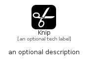

# Knip


```text
simpleicons-14/K/Knip
```

```text
include('simpleicons-14/K/Knip')
```


| Illustration | Knip |
| :---: | :---: |
|  |  |


## Sprites
The item provides the following sriptes:

- `<$KnipXs>`
- `<$KnipSm>`
- `<$KnipMd>`
- `<$KnipLg>`


## Knip

### Load remotely
```plantuml
@startuml
' configures the library
!global $LIB_BASE_LOCATION="https://raw.githubusercontent.com/tmorin/plantuml-libs/master/distribution"

' loads the library's bootstrap
!include $LIB_BASE_LOCATION/bootstrap.puml

' loads the package bootstrap
include('simpleicons-14/bootstrap')

' loads the Item which embeds the element Knip
include('simpleicons-14/K/Knip')

' renders the element
Knip('Knip', 'Knip', 'an optional tech label', 'an optional description')
@enduml
```

### Load locally
```plantuml
@startuml
' configures the library
!global $INCLUSION_MODE="local"
!global $LIB_BASE_LOCATION="../.."

' loads the library's bootstrap
!include $LIB_BASE_LOCATION/bootstrap.puml

' loads the package bootstrap
include('simpleicons-14/bootstrap')

' loads the Item which embeds the element Knip
include('simpleicons-14/K/Knip')

' renders the element
Knip('Knip', 'Knip', 'an optional tech label', 'an optional description')
@enduml
```

