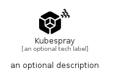

# Kubespray


```text
simpleicons-14/K/Kubespray
```

```text
include('simpleicons-14/K/Kubespray')
```


| Illustration | Kubespray |
| :---: | :---: |
|  |  |


## Sprites
The item provides the following sriptes:

- `<$KubesprayXs>`
- `<$KubespraySm>`
- `<$KubesprayMd>`
- `<$KubesprayLg>`


## Kubespray

### Load remotely
```plantuml
@startuml
' configures the library
!global $LIB_BASE_LOCATION="https://raw.githubusercontent.com/tmorin/plantuml-libs/master/distribution"

' loads the library's bootstrap
!include $LIB_BASE_LOCATION/bootstrap.puml

' loads the package bootstrap
include('simpleicons-14/bootstrap')

' loads the Item which embeds the element Kubespray
include('simpleicons-14/K/Kubespray')

' renders the element
Kubespray('Kubespray', 'Kubespray', 'an optional tech label', 'an optional description')
@enduml
```

### Load locally
```plantuml
@startuml
' configures the library
!global $INCLUSION_MODE="local"
!global $LIB_BASE_LOCATION="../.."

' loads the library's bootstrap
!include $LIB_BASE_LOCATION/bootstrap.puml

' loads the package bootstrap
include('simpleicons-14/bootstrap')

' loads the Item which embeds the element Kubespray
include('simpleicons-14/K/Kubespray')

' renders the element
Kubespray('Kubespray', 'Kubespray', 'an optional tech label', 'an optional description')
@enduml
```

