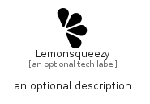

# Lemonsqueezy


```text
simpleicons-14/L/Lemonsqueezy
```

```text
include('simpleicons-14/L/Lemonsqueezy')
```


| Illustration | Lemonsqueezy |
| :---: | :---: |
|  |  |


## Sprites
The item provides the following sriptes:

- `<$LemonsqueezyXs>`
- `<$LemonsqueezySm>`
- `<$LemonsqueezyMd>`
- `<$LemonsqueezyLg>`


## Lemonsqueezy

### Load remotely
```plantuml
@startuml
' configures the library
!global $LIB_BASE_LOCATION="https://raw.githubusercontent.com/tmorin/plantuml-libs/master/distribution"

' loads the library's bootstrap
!include $LIB_BASE_LOCATION/bootstrap.puml

' loads the package bootstrap
include('simpleicons-14/bootstrap')

' loads the Item which embeds the element Lemonsqueezy
include('simpleicons-14/L/Lemonsqueezy')

' renders the element
Lemonsqueezy('Lemonsqueezy', 'Lemonsqueezy', 'an optional tech label', 'an optional description')
@enduml
```

### Load locally
```plantuml
@startuml
' configures the library
!global $INCLUSION_MODE="local"
!global $LIB_BASE_LOCATION="../.."

' loads the library's bootstrap
!include $LIB_BASE_LOCATION/bootstrap.puml

' loads the package bootstrap
include('simpleicons-14/bootstrap')

' loads the Item which embeds the element Lemonsqueezy
include('simpleicons-14/L/Lemonsqueezy')

' renders the element
Lemonsqueezy('Lemonsqueezy', 'Lemonsqueezy', 'an optional tech label', 'an optional description')
@enduml
```

