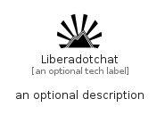

# Liberadotchat


```text
simpleicons-14/L/Liberadotchat
```

```text
include('simpleicons-14/L/Liberadotchat')
```


| Illustration | Liberadotchat |
| :---: | :---: |
|  |  |


## Sprites
The item provides the following sriptes:

- `<$LiberadotchatXs>`
- `<$LiberadotchatSm>`
- `<$LiberadotchatMd>`
- `<$LiberadotchatLg>`


## Liberadotchat

### Load remotely
```plantuml
@startuml
' configures the library
!global $LIB_BASE_LOCATION="https://raw.githubusercontent.com/tmorin/plantuml-libs/master/distribution"

' loads the library's bootstrap
!include $LIB_BASE_LOCATION/bootstrap.puml

' loads the package bootstrap
include('simpleicons-14/bootstrap')

' loads the Item which embeds the element Liberadotchat
include('simpleicons-14/L/Liberadotchat')

' renders the element
Liberadotchat('Liberadotchat', 'Liberadotchat', 'an optional tech label', 'an optional description')
@enduml
```

### Load locally
```plantuml
@startuml
' configures the library
!global $INCLUSION_MODE="local"
!global $LIB_BASE_LOCATION="../.."

' loads the library's bootstrap
!include $LIB_BASE_LOCATION/bootstrap.puml

' loads the package bootstrap
include('simpleicons-14/bootstrap')

' loads the Item which embeds the element Liberadotchat
include('simpleicons-14/L/Liberadotchat')

' renders the element
Liberadotchat('Liberadotchat', 'Liberadotchat', 'an optional tech label', 'an optional description')
@enduml
```

