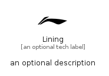

# Lining


```text
simpleicons-14/L/Lining
```

```text
include('simpleicons-14/L/Lining')
```


| Illustration | Lining |
| :---: | :---: |
|  |  |


## Sprites
The item provides the following sriptes:

- `<$LiningXs>`
- `<$LiningSm>`
- `<$LiningMd>`
- `<$LiningLg>`


## Lining

### Load remotely
```plantuml
@startuml
' configures the library
!global $LIB_BASE_LOCATION="https://raw.githubusercontent.com/tmorin/plantuml-libs/master/distribution"

' loads the library's bootstrap
!include $LIB_BASE_LOCATION/bootstrap.puml

' loads the package bootstrap
include('simpleicons-14/bootstrap')

' loads the Item which embeds the element Lining
include('simpleicons-14/L/Lining')

' renders the element
Lining('Lining', 'Lining', 'an optional tech label', 'an optional description')
@enduml
```

### Load locally
```plantuml
@startuml
' configures the library
!global $INCLUSION_MODE="local"
!global $LIB_BASE_LOCATION="../.."

' loads the library's bootstrap
!include $LIB_BASE_LOCATION/bootstrap.puml

' loads the package bootstrap
include('simpleicons-14/bootstrap')

' loads the Item which embeds the element Lining
include('simpleicons-14/L/Lining')

' renders the element
Lining('Lining', 'Lining', 'an optional tech label', 'an optional description')
@enduml
```

