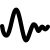
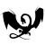
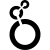

# L

The module contains 127 items.

| |Name|
|:---:|---|
|  | [simpleicons-14/L/Labex](../../simpleicons-14/L/Labex.md) |
|  | [simpleicons-14/L/Labview](../../simpleicons-14/L/Labview.md) |
|  | [simpleicons-14/L/Lada](../../simpleicons-14/L/Lada.md) |
|  | [simpleicons-14/L/Lamborghini](../../simpleicons-14/L/Lamborghini.md) |
|  | [simpleicons-14/L/Langchain](../../simpleicons-14/L/Langchain.md) |
|  | [simpleicons-14/L/Langflow](../../simpleicons-14/L/Langflow.md) |
|  | [simpleicons-14/L/Langgraph](../../simpleicons-14/L/Langgraph.md) |
|  | [simpleicons-14/L/Languagetool](../../simpleicons-14/L/Languagetool.md) |
|  | [simpleicons-14/L/Lapce](../../simpleicons-14/L/Lapce.md) |
|  | [simpleicons-14/L/Laragon](../../simpleicons-14/L/Laragon.md) |
|  | [simpleicons-14/L/Laravel](../../simpleicons-14/L/Laravel.md) |
|  | [simpleicons-14/L/Laravelhorizon](../../simpleicons-14/L/Laravelhorizon.md) |
|  | [simpleicons-14/L/Laravelnova](../../simpleicons-14/L/Laravelnova.md) |
|  | [simpleicons-14/L/Lastdotfm](../../simpleicons-14/L/Lastdotfm.md) |
|  | [simpleicons-14/L/Lastpass](../../simpleicons-14/L/Lastpass.md) |
|  | [simpleicons-14/L/Latex](../../simpleicons-14/L/Latex.md) |
|  | [simpleicons-14/L/Launchpad](../../simpleicons-14/L/Launchpad.md) |
|  | [simpleicons-14/L/Lazarus](../../simpleicons-14/L/Lazarus.md) |
|  | [simpleicons-14/L/Lazyvim](../../simpleicons-14/L/Lazyvim.md) |
|  | [simpleicons-14/L/Lbry](../../simpleicons-14/L/Lbry.md) |
|  | [simpleicons-14/L/Leaderprice](../../simpleicons-14/L/Leaderprice.md) |
|  | [simpleicons-14/L/Leaflet](../../simpleicons-14/L/Leaflet.md) |
|  | [simpleicons-14/L/Leagueoflegends](../../simpleicons-14/L/Leagueoflegends.md) |
|  | [simpleicons-14/L/Leanpub](../../simpleicons-14/L/Leanpub.md) |
|  | [simpleicons-14/L/Leetcode](../../simpleicons-14/L/Leetcode.md) |
|  | [simpleicons-14/L/Lefthook](../../simpleicons-14/L/Lefthook.md) |
|  | [simpleicons-14/L/Legacygames](../../simpleicons-14/L/Legacygames.md) |
|  | [simpleicons-14/L/Leica](../../simpleicons-14/L/Leica.md) |
|  | [simpleicons-14/L/Lemmy](../../simpleicons-14/L/Lemmy.md) |
|  | [simpleicons-14/L/Lemonsqueezy](../../simpleicons-14/L/Lemonsqueezy.md) |
|  | [simpleicons-14/L/Lenovo](../../simpleicons-14/L/Lenovo.md) |
|  | [simpleicons-14/L/Lens](../../simpleicons-14/L/Lens.md) |
|  | [simpleicons-14/L/Leptos](../../simpleicons-14/L/Leptos.md) |
|  | [simpleicons-14/L/Lequipe](../../simpleicons-14/L/Lequipe.md) |
|  | [simpleicons-14/L/Lerna](../../simpleicons-14/L/Lerna.md) |
|  | [simpleicons-14/L/Leroymerlin](../../simpleicons-14/L/Leroymerlin.md) |
|  | [simpleicons-14/L/Leslibraires](../../simpleicons-14/L/Leslibraires.md) |
|  | [simpleicons-14/L/Less](../../simpleicons-14/L/Less.md) |
|  | [simpleicons-14/L/Letsencrypt](../../simpleicons-14/L/Letsencrypt.md) |
|  | [simpleicons-14/L/Letterboxd](../../simpleicons-14/L/Letterboxd.md) |
|  | [simpleicons-14/L/Levelsdotfyi](../../simpleicons-14/L/Levelsdotfyi.md) |
|  | [simpleicons-14/L/Lg](../../simpleicons-14/L/Lg.md) |
|  | [simpleicons-14/L/Liberadotchat](../../simpleicons-14/L/Liberadotchat.md) |
|  | [simpleicons-14/L/Liberapay](../../simpleicons-14/L/Liberapay.md) |
|  | [simpleicons-14/L/Librariesdotio](../../simpleicons-14/L/Librariesdotio.md) |
|  | [simpleicons-14/L/Librarything](../../simpleicons-14/L/Librarything.md) |
|  | [simpleicons-14/L/Libreoffice](../../simpleicons-14/L/Libreoffice.md) |
|  | [simpleicons-14/L/Libreofficebase](../../simpleicons-14/L/Libreofficebase.md) |
|  | [simpleicons-14/L/Libreofficecalc](../../simpleicons-14/L/Libreofficecalc.md) |
|  | [simpleicons-14/L/Libreofficedraw](../../simpleicons-14/L/Libreofficedraw.md) |
|  | [simpleicons-14/L/Libreofficeimpress](../../simpleicons-14/L/Libreofficeimpress.md) |
|  | [simpleicons-14/L/Libreofficemath](../../simpleicons-14/L/Libreofficemath.md) |
|  | [simpleicons-14/L/Libreofficewriter](../../simpleicons-14/L/Libreofficewriter.md) |
|  | [simpleicons-14/L/Libretranslate](../../simpleicons-14/L/Libretranslate.md) |
|  | [simpleicons-14/L/Libretube](../../simpleicons-14/L/Libretube.md) |
|  | [simpleicons-14/L/Librewolf](../../simpleicons-14/L/Librewolf.md) |
|  | [simpleicons-14/L/Libuv](../../simpleicons-14/L/Libuv.md) |
|  | [simpleicons-14/L/Lichess](../../simpleicons-14/L/Lichess.md) |
|  | [simpleicons-14/L/Lidl](../../simpleicons-14/L/Lidl.md) |
|  | [simpleicons-14/L/Lifx](../../simpleicons-14/L/Lifx.md) |
|  | [simpleicons-14/L/Lightburn](../../simpleicons-14/L/Lightburn.md) |
|  | [simpleicons-14/L/Lighthouse](../../simpleicons-14/L/Lighthouse.md) |
|  | [simpleicons-14/L/Lightning](../../simpleicons-14/L/Lightning.md) |
|  | [simpleicons-14/L/Limesurvey](../../simpleicons-14/L/Limesurvey.md) |
|  | [simpleicons-14/L/Line](../../simpleicons-14/L/Line.md) |
|  | [simpleicons-14/L/Lineageos](../../simpleicons-14/L/Lineageos.md) |
|  | [simpleicons-14/L/Linear](../../simpleicons-14/L/Linear.md) |
|  | [simpleicons-14/L/Lining](../../simpleicons-14/L/Lining.md) |
|  | [simpleicons-14/L/Linkerd](../../simpleicons-14/L/Linkerd.md) |
|  | [simpleicons-14/L/Linkfire](../../simpleicons-14/L/Linkfire.md) |
|  | [simpleicons-14/L/Linksys](../../simpleicons-14/L/Linksys.md) |
|  | [simpleicons-14/L/Linktree](../../simpleicons-14/L/Linktree.md) |
|  | [simpleicons-14/L/Linphone](../../simpleicons-14/L/Linphone.md) |
|  | [simpleicons-14/L/Lintcode](../../simpleicons-14/L/Lintcode.md) |
|  | [simpleicons-14/L/Linux](../../simpleicons-14/L/Linux.md) |
|  | [simpleicons-14/L/Linuxcontainers](../../simpleicons-14/L/Linuxcontainers.md) |
|  | [simpleicons-14/L/Linuxfoundation](../../simpleicons-14/L/Linuxfoundation.md) |
|  | [simpleicons-14/L/Linuxmint](../../simpleicons-14/L/Linuxmint.md) |
|  | [simpleicons-14/L/Linuxprofessionalinstitute](../../simpleicons-14/L/Linuxprofessionalinstitute.md) |
|  | [simpleicons-14/L/Linuxserver](../../simpleicons-14/L/Linuxserver.md) |
|  | [simpleicons-14/L/Lionair](../../simpleicons-14/L/Lionair.md) |
|  | [simpleicons-14/L/Liquibase](../../simpleicons-14/L/Liquibase.md) |
|  | [simpleicons-14/L/Listenhub](../../simpleicons-14/L/Listenhub.md) |
|  | [simpleicons-14/L/Listmonk](../../simpleicons-14/L/Listmonk.md) |
|  | [simpleicons-14/L/Lit](../../simpleicons-14/L/Lit.md) |
|  | [simpleicons-14/L/Litecoin](../../simpleicons-14/L/Litecoin.md) |
|  | [simpleicons-14/L/Literal](../../simpleicons-14/L/Literal.md) |
|  | [simpleicons-14/L/Litiengine](../../simpleicons-14/L/Litiengine.md) |
|  | [simpleicons-14/L/Livechat](../../simpleicons-14/L/Livechat.md) |
|  | [simpleicons-14/L/Livejournal](../../simpleicons-14/L/Livejournal.md) |
|  | [simpleicons-14/L/Livekit](../../simpleicons-14/L/Livekit.md) |
|  | [simpleicons-14/L/Livewire](../../simpleicons-14/L/Livewire.md) |
|  | [simpleicons-14/L/Llvm](../../simpleicons-14/L/Llvm.md) |
|  | [simpleicons-14/L/Lmms](../../simpleicons-14/L/Lmms.md) |
|  | [simpleicons-14/L/Lobsters](../../simpleicons-14/L/Lobsters.md) |
|  | [simpleicons-14/L/Local](../../simpleicons-14/L/Local.md) |
|  | [simpleicons-14/L/Localsend](../../simpleicons-14/L/Localsend.md) |
|  | [simpleicons-14/L/Localxpose](../../simpleicons-14/L/Localxpose.md) |
|  | [simpleicons-14/L/Lodash](../../simpleicons-14/L/Lodash.md) |
|  | [simpleicons-14/L/Logmein](../../simpleicons-14/L/Logmein.md) |
|  | [simpleicons-14/L/Logseq](../../simpleicons-14/L/Logseq.md) |
|  | [simpleicons-14/L/Logstash](../../simpleicons-14/L/Logstash.md) |
|  | [simpleicons-14/L/Looker](../../simpleicons-14/L/Looker.md) |
|  | [simpleicons-14/L/Loom](../../simpleicons-14/L/Loom.md) |
|  | [simpleicons-14/L/Loop](../../simpleicons-14/L/Loop.md) |
|  | [simpleicons-14/L/Loopback](../../simpleicons-14/L/Loopback.md) |
|  | [simpleicons-14/L/Lootcrate](../../simpleicons-14/L/Lootcrate.md) |
|  | [simpleicons-14/L/Lospec](../../simpleicons-14/L/Lospec.md) |
|  | [simpleicons-14/L/Lotpolishairlines](../../simpleicons-14/L/Lotpolishairlines.md) |
|  | [simpleicons-14/L/Lottiefiles](../../simpleicons-14/L/Lottiefiles.md) |
|  | [simpleicons-14/L/Ltspice](../../simpleicons-14/L/Ltspice.md) |
|  | [simpleicons-14/L/Lua](../../simpleicons-14/L/Lua.md) |
|  | [simpleicons-14/L/Luanti](../../simpleicons-14/L/Luanti.md) |
|  | [simpleicons-14/L/Luau](../../simpleicons-14/L/Luau.md) |
|  | [simpleicons-14/L/Lubuntu](../../simpleicons-14/L/Lubuntu.md) |
|  | [simpleicons-14/L/Lucia](../../simpleicons-14/L/Lucia.md) |
|  | [simpleicons-14/L/Lucid](../../simpleicons-14/L/Lucid.md) |
|  | [simpleicons-14/L/Lucide](../../simpleicons-14/L/Lucide.md) |
|  | [simpleicons-14/L/Ludwig](../../simpleicons-14/L/Ludwig.md) |
|  | [simpleicons-14/L/Lufthansa](../../simpleicons-14/L/Lufthansa.md) |
|  | [simpleicons-14/L/Lumen](../../simpleicons-14/L/Lumen.md) |
|  | [simpleicons-14/L/Lunacy](../../simpleicons-14/L/Lunacy.md) |
|  | [simpleicons-14/L/Luogu](../../simpleicons-14/L/Luogu.md) |
|  | [simpleicons-14/L/Lutris](../../simpleicons-14/L/Lutris.md) |
|  | [simpleicons-14/L/Lvgl](../../simpleicons-14/L/Lvgl.md) |
|  | [simpleicons-14/L/Lydia](../../simpleicons-14/L/Lydia.md) |
|  | [simpleicons-14/L/Lyft](../../simpleicons-14/L/Lyft.md) |

