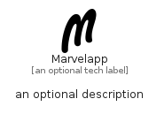

# Marvelapp


```text
simpleicons-14/M/Marvelapp
```

```text
include('simpleicons-14/M/Marvelapp')
```


| Illustration | Marvelapp |
| :---: | :---: |
|  |  |


## Sprites
The item provides the following sriptes:

- `<$MarvelappXs>`
- `<$MarvelappSm>`
- `<$MarvelappMd>`
- `<$MarvelappLg>`


## Marvelapp

### Load remotely
```plantuml
@startuml
' configures the library
!global $LIB_BASE_LOCATION="https://raw.githubusercontent.com/tmorin/plantuml-libs/master/distribution"

' loads the library's bootstrap
!include $LIB_BASE_LOCATION/bootstrap.puml

' loads the package bootstrap
include('simpleicons-14/bootstrap')

' loads the Item which embeds the element Marvelapp
include('simpleicons-14/M/Marvelapp')

' renders the element
Marvelapp('Marvelapp', 'Marvelapp', 'an optional tech label', 'an optional description')
@enduml
```

### Load locally
```plantuml
@startuml
' configures the library
!global $INCLUSION_MODE="local"
!global $LIB_BASE_LOCATION="../.."

' loads the library's bootstrap
!include $LIB_BASE_LOCATION/bootstrap.puml

' loads the package bootstrap
include('simpleicons-14/bootstrap')

' loads the Item which embeds the element Marvelapp
include('simpleicons-14/M/Marvelapp')

' renders the element
Marvelapp('Marvelapp', 'Marvelapp', 'an optional tech label', 'an optional description')
@enduml
```

