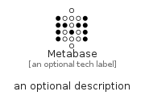

# Metabase


```text
simpleicons-14/M/Metabase
```

```text
include('simpleicons-14/M/Metabase')
```


| Illustration | Metabase |
| :---: | :---: |
|  |  |


## Sprites
The item provides the following sriptes:

- `<$MetabaseXs>`
- `<$MetabaseSm>`
- `<$MetabaseMd>`
- `<$MetabaseLg>`


## Metabase

### Load remotely
```plantuml
@startuml
' configures the library
!global $LIB_BASE_LOCATION="https://raw.githubusercontent.com/tmorin/plantuml-libs/master/distribution"

' loads the library's bootstrap
!include $LIB_BASE_LOCATION/bootstrap.puml

' loads the package bootstrap
include('simpleicons-14/bootstrap')

' loads the Item which embeds the element Metabase
include('simpleicons-14/M/Metabase')

' renders the element
Metabase('Metabase', 'Metabase', 'an optional tech label', 'an optional description')
@enduml
```

### Load locally
```plantuml
@startuml
' configures the library
!global $INCLUSION_MODE="local"
!global $LIB_BASE_LOCATION="../.."

' loads the library's bootstrap
!include $LIB_BASE_LOCATION/bootstrap.puml

' loads the package bootstrap
include('simpleicons-14/bootstrap')

' loads the Item which embeds the element Metabase
include('simpleicons-14/M/Metabase')

' renders the element
Metabase('Metabase', 'Metabase', 'an optional tech label', 'an optional description')
@enduml
```

