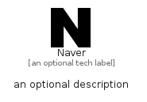

# Naver


```text
simpleicons-14/N/Naver
```

```text
include('simpleicons-14/N/Naver')
```


| Illustration | Naver |
| :---: | :---: |
|  |  |


## Sprites
The item provides the following sriptes:

- `<$NaverXs>`
- `<$NaverSm>`
- `<$NaverMd>`
- `<$NaverLg>`


## Naver

### Load remotely
```plantuml
@startuml
' configures the library
!global $LIB_BASE_LOCATION="https://raw.githubusercontent.com/tmorin/plantuml-libs/master/distribution"

' loads the library's bootstrap
!include $LIB_BASE_LOCATION/bootstrap.puml

' loads the package bootstrap
include('simpleicons-14/bootstrap')

' loads the Item which embeds the element Naver
include('simpleicons-14/N/Naver')

' renders the element
Naver('Naver', 'Naver', 'an optional tech label', 'an optional description')
@enduml
```

### Load locally
```plantuml
@startuml
' configures the library
!global $INCLUSION_MODE="local"
!global $LIB_BASE_LOCATION="../.."

' loads the library's bootstrap
!include $LIB_BASE_LOCATION/bootstrap.puml

' loads the package bootstrap
include('simpleicons-14/bootstrap')

' loads the Item which embeds the element Naver
include('simpleicons-14/N/Naver')

' renders the element
Naver('Naver', 'Naver', 'an optional tech label', 'an optional description')
@enduml
```

