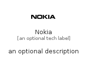

# Nokia


```text
simpleicons-14/N/Nokia
```

```text
include('simpleicons-14/N/Nokia')
```


| Illustration | Nokia |
| :---: | :---: |
|  |  |


## Sprites
The item provides the following sriptes:

- `<$NokiaXs>`
- `<$NokiaSm>`
- `<$NokiaMd>`
- `<$NokiaLg>`


## Nokia

### Load remotely
```plantuml
@startuml
' configures the library
!global $LIB_BASE_LOCATION="https://raw.githubusercontent.com/tmorin/plantuml-libs/master/distribution"

' loads the library's bootstrap
!include $LIB_BASE_LOCATION/bootstrap.puml

' loads the package bootstrap
include('simpleicons-14/bootstrap')

' loads the Item which embeds the element Nokia
include('simpleicons-14/N/Nokia')

' renders the element
Nokia('Nokia', 'Nokia', 'an optional tech label', 'an optional description')
@enduml
```

### Load locally
```plantuml
@startuml
' configures the library
!global $INCLUSION_MODE="local"
!global $LIB_BASE_LOCATION="../.."

' loads the library's bootstrap
!include $LIB_BASE_LOCATION/bootstrap.puml

' loads the package bootstrap
include('simpleicons-14/bootstrap')

' loads the Item which embeds the element Nokia
include('simpleicons-14/N/Nokia')

' renders the element
Nokia('Nokia', 'Nokia', 'an optional tech label', 'an optional description')
@enduml
```

