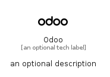

# Odoo


```text
simpleicons-14/O/Odoo
```

```text
include('simpleicons-14/O/Odoo')
```


| Illustration | Odoo |
| :---: | :---: |
|  |  |


## Sprites
The item provides the following sriptes:

- `<$OdooXs>`
- `<$OdooSm>`
- `<$OdooMd>`
- `<$OdooLg>`


## Odoo

### Load remotely
```plantuml
@startuml
' configures the library
!global $LIB_BASE_LOCATION="https://raw.githubusercontent.com/tmorin/plantuml-libs/master/distribution"

' loads the library's bootstrap
!include $LIB_BASE_LOCATION/bootstrap.puml

' loads the package bootstrap
include('simpleicons-14/bootstrap')

' loads the Item which embeds the element Odoo
include('simpleicons-14/O/Odoo')

' renders the element
Odoo('Odoo', 'Odoo', 'an optional tech label', 'an optional description')
@enduml
```

### Load locally
```plantuml
@startuml
' configures the library
!global $INCLUSION_MODE="local"
!global $LIB_BASE_LOCATION="../.."

' loads the library's bootstrap
!include $LIB_BASE_LOCATION/bootstrap.puml

' loads the package bootstrap
include('simpleicons-14/bootstrap')

' loads the Item which embeds the element Odoo
include('simpleicons-14/O/Odoo')

' renders the element
Odoo('Odoo', 'Odoo', 'an optional tech label', 'an optional description')
@enduml
```

