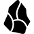
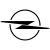
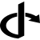

# O

The module contains 72 items.

| |Name|
|:---:|---|
|  | [simpleicons-14/O/Observable](../../simpleicons-14/O/Observable.md) |
|  | [simpleicons-14/O/Obsidian](../../simpleicons-14/O/Obsidian.md) |
|  | [simpleicons-14/O/Obsstudio](../../simpleicons-14/O/Obsstudio.md) |
|  | [simpleicons-14/O/Ocaml](../../simpleicons-14/O/Ocaml.md) |
|  | [simpleicons-14/O/Octanerender](../../simpleicons-14/O/Octanerender.md) |
|  | [simpleicons-14/O/Octave](../../simpleicons-14/O/Octave.md) |
|  | [simpleicons-14/O/Octoprint](../../simpleicons-14/O/Octoprint.md) |
|  | [simpleicons-14/O/Octopusdeploy](../../simpleicons-14/O/Octopusdeploy.md) |
|  | [simpleicons-14/O/Oculus](../../simpleicons-14/O/Oculus.md) |
|  | [simpleicons-14/O/Odnoklassniki](../../simpleicons-14/O/Odnoklassniki.md) |
|  | [simpleicons-14/O/Odysee](../../simpleicons-14/O/Odysee.md) |
|  | [simpleicons-14/O/Ohdear](../../simpleicons-14/O/Ohdear.md) |
|  | [simpleicons-14/O/Okcupid](../../simpleicons-14/O/Okcupid.md) |
|  | [simpleicons-14/O/Okta](../../simpleicons-14/O/Okta.md) |
|  | [simpleicons-14/O/Oneplus](../../simpleicons-14/O/Oneplus.md) |
|  | [simpleicons-14/O/Onlyfans](../../simpleicons-14/O/Onlyfans.md) |
|  | [simpleicons-14/O/Onlyoffice](../../simpleicons-14/O/Onlyoffice.md) |
|  | [simpleicons-14/O/Onnx](../../simpleicons-14/O/Onnx.md) |
|  | [simpleicons-14/O/Onstar](../../simpleicons-14/O/Onstar.md) |
|  | [simpleicons-14/O/Opel](../../simpleicons-14/O/Opel.md) |
|  | [simpleicons-14/O/Openaccess](../../simpleicons-14/O/Openaccess.md) |
|  | [simpleicons-14/O/Openai](../../simpleicons-14/O/Openai.md) |
|  | [simpleicons-14/O/Openaigym](../../simpleicons-14/O/Openaigym.md) |
|  | [simpleicons-14/O/Openapiinitiative](../../simpleicons-14/O/Openapiinitiative.md) |
|  | [simpleicons-14/O/Openbadges](../../simpleicons-14/O/Openbadges.md) |
|  | [simpleicons-14/O/Openbsd](../../simpleicons-14/O/Openbsd.md) |
|  | [simpleicons-14/O/Openbugbounty](../../simpleicons-14/O/Openbugbounty.md) |
|  | [simpleicons-14/O/Opencollective](../../simpleicons-14/O/Opencollective.md) |
|  | [simpleicons-14/O/Opencontainersinitiative](../../simpleicons-14/O/Opencontainersinitiative.md) |
|  | [simpleicons-14/O/Opencv](../../simpleicons-14/O/Opencv.md) |
|  | [simpleicons-14/O/Openfaas](../../simpleicons-14/O/Openfaas.md) |
|  | [simpleicons-14/O/Opengl](../../simpleicons-14/O/Opengl.md) |
|  | [simpleicons-14/O/Openid](../../simpleicons-14/O/Openid.md) |
|  | [simpleicons-14/O/Openjdk](../../simpleicons-14/O/Openjdk.md) |
|  | [simpleicons-14/O/Openlayers](../../simpleicons-14/O/Openlayers.md) |
|  | [simpleicons-14/O/Openmined](../../simpleicons-14/O/Openmined.md) |
|  | [simpleicons-14/O/Opennebula](../../simpleicons-14/O/Opennebula.md) |
|  | [simpleicons-14/O/Openproject](../../simpleicons-14/O/Openproject.md) |
|  | [simpleicons-14/O/Opensea](../../simpleicons-14/O/Opensea.md) |
|  | [simpleicons-14/O/Opensearch](../../simpleicons-14/O/Opensearch.md) |
|  | [simpleicons-14/O/Opensourceinitiative](../../simpleicons-14/O/Opensourceinitiative.md) |
|  | [simpleicons-14/O/Openssl](../../simpleicons-14/O/Openssl.md) |
|  | [simpleicons-14/O/Openstack](../../simpleicons-14/O/Openstack.md) |
|  | [simpleicons-14/O/Openstreetmap](../../simpleicons-14/O/Openstreetmap.md) |
|  | [simpleicons-14/O/Opensuse](../../simpleicons-14/O/Opensuse.md) |
|  | [simpleicons-14/O/Opentelemetry](../../simpleicons-14/O/Opentelemetry.md) |
|  | [simpleicons-14/O/Openverse](../../simpleicons-14/O/Openverse.md) |
|  | [simpleicons-14/O/Openvpn](../../simpleicons-14/O/Openvpn.md) |
|  | [simpleicons-14/O/Openwrt](../../simpleicons-14/O/Openwrt.md) |
|  | [simpleicons-14/O/Openzeppelin](../../simpleicons-14/O/Openzeppelin.md) |
|  | [simpleicons-14/O/Openzfs](../../simpleicons-14/O/Openzfs.md) |
|  | [simpleicons-14/O/Opera](../../simpleicons-14/O/Opera.md) |
|  | [simpleicons-14/O/Opnsense](../../simpleicons-14/O/Opnsense.md) |
|  | [simpleicons-14/O/Opsgenie](../../simpleicons-14/O/Opsgenie.md) |
|  | [simpleicons-14/O/Opslevel](../../simpleicons-14/O/Opslevel.md) |
|  | [simpleicons-14/O/Oracle](../../simpleicons-14/O/Oracle.md) |
|  | [simpleicons-14/O/Orcid](../../simpleicons-14/O/Orcid.md) |
|  | [simpleicons-14/O/Oreilly](../../simpleicons-14/O/Oreilly.md) |
|  | [simpleicons-14/O/Org](../../simpleicons-14/O/Org.md) |
|  | [simpleicons-14/O/Origin](../../simpleicons-14/O/Origin.md) |
|  | [simpleicons-14/O/Osano](../../simpleicons-14/O/Osano.md) |
|  | [simpleicons-14/O/Osgeo](../../simpleicons-14/O/Osgeo.md) |
|  | [simpleicons-14/O/Oshkosh](../../simpleicons-14/O/Oshkosh.md) |
|  | [simpleicons-14/O/Osmc](../../simpleicons-14/O/Osmc.md) |
|  | [simpleicons-14/O/Osu](../../simpleicons-14/O/Osu.md) |
|  | [simpleicons-14/O/Otto](../../simpleicons-14/O/Otto.md) |
|  | [simpleicons-14/O/Overcast](../../simpleicons-14/O/Overcast.md) |
|  | [simpleicons-14/O/Overleaf](../../simpleicons-14/O/Overleaf.md) |
|  | [simpleicons-14/O/Ovh](../../simpleicons-14/O/Ovh.md) |
|  | [simpleicons-14/O/Owasp](../../simpleicons-14/O/Owasp.md) |
|  | [simpleicons-14/O/Oxygen](../../simpleicons-14/O/Oxygen.md) |
|  | [simpleicons-14/O/Oyo](../../simpleicons-14/O/Oyo.md) |

