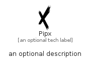

# Pipx


```text
simpleicons-14/P/Pipx
```

```text
include('simpleicons-14/P/Pipx')
```


| Illustration | Pipx |
| :---: | :---: |
|  |  |


## Sprites
The item provides the following sriptes:

- `<$PipxXs>`
- `<$PipxSm>`
- `<$PipxMd>`
- `<$PipxLg>`


## Pipx

### Load remotely
```plantuml
@startuml
' configures the library
!global $LIB_BASE_LOCATION="https://raw.githubusercontent.com/tmorin/plantuml-libs/master/distribution"

' loads the library's bootstrap
!include $LIB_BASE_LOCATION/bootstrap.puml

' loads the package bootstrap
include('simpleicons-14/bootstrap')

' loads the Item which embeds the element Pipx
include('simpleicons-14/P/Pipx')

' renders the element
Pipx('Pipx', 'Pipx', 'an optional tech label', 'an optional description')
@enduml
```

### Load locally
```plantuml
@startuml
' configures the library
!global $INCLUSION_MODE="local"
!global $LIB_BASE_LOCATION="../.."

' loads the library's bootstrap
!include $LIB_BASE_LOCATION/bootstrap.puml

' loads the package bootstrap
include('simpleicons-14/bootstrap')

' loads the Item which embeds the element Pipx
include('simpleicons-14/P/Pipx')

' renders the element
Pipx('Pipx', 'Pipx', 'an optional tech label', 'an optional description')
@enduml
```

