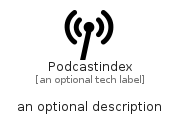

# Podcastindex


```text
simpleicons-14/P/Podcastindex
```

```text
include('simpleicons-14/P/Podcastindex')
```


| Illustration | Podcastindex |
| :---: | :---: |
|  |  |


## Sprites
The item provides the following sriptes:

- `<$PodcastindexXs>`
- `<$PodcastindexSm>`
- `<$PodcastindexMd>`
- `<$PodcastindexLg>`


## Podcastindex

### Load remotely
```plantuml
@startuml
' configures the library
!global $LIB_BASE_LOCATION="https://raw.githubusercontent.com/tmorin/plantuml-libs/master/distribution"

' loads the library's bootstrap
!include $LIB_BASE_LOCATION/bootstrap.puml

' loads the package bootstrap
include('simpleicons-14/bootstrap')

' loads the Item which embeds the element Podcastindex
include('simpleicons-14/P/Podcastindex')

' renders the element
Podcastindex('Podcastindex', 'Podcastindex', 'an optional tech label', 'an optional description')
@enduml
```

### Load locally
```plantuml
@startuml
' configures the library
!global $INCLUSION_MODE="local"
!global $LIB_BASE_LOCATION="../.."

' loads the library's bootstrap
!include $LIB_BASE_LOCATION/bootstrap.puml

' loads the package bootstrap
include('simpleicons-14/bootstrap')

' loads the Item which embeds the element Podcastindex
include('simpleicons-14/P/Podcastindex')

' renders the element
Podcastindex('Podcastindex', 'Podcastindex', 'an optional tech label', 'an optional description')
@enduml
```

