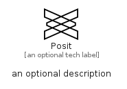

# Posit


```text
simpleicons-14/P/Posit
```

```text
include('simpleicons-14/P/Posit')
```


| Illustration | Posit |
| :---: | :---: |
|  |  |


## Sprites
The item provides the following sriptes:

- `<$PositXs>`
- `<$PositSm>`
- `<$PositMd>`
- `<$PositLg>`


## Posit

### Load remotely
```plantuml
@startuml
' configures the library
!global $LIB_BASE_LOCATION="https://raw.githubusercontent.com/tmorin/plantuml-libs/master/distribution"

' loads the library's bootstrap
!include $LIB_BASE_LOCATION/bootstrap.puml

' loads the package bootstrap
include('simpleicons-14/bootstrap')

' loads the Item which embeds the element Posit
include('simpleicons-14/P/Posit')

' renders the element
Posit('Posit', 'Posit', 'an optional tech label', 'an optional description')
@enduml
```

### Load locally
```plantuml
@startuml
' configures the library
!global $INCLUSION_MODE="local"
!global $LIB_BASE_LOCATION="../.."

' loads the library's bootstrap
!include $LIB_BASE_LOCATION/bootstrap.puml

' loads the package bootstrap
include('simpleicons-14/bootstrap')

' loads the Item which embeds the element Posit
include('simpleicons-14/P/Posit')

' renders the element
Posit('Posit', 'Posit', 'an optional tech label', 'an optional description')
@enduml
```

