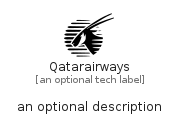

# Qatarairways


```text
simpleicons-14/Q/Qatarairways
```

```text
include('simpleicons-14/Q/Qatarairways')
```


| Illustration | Qatarairways |
| :---: | :---: |
|  |  |


## Sprites
The item provides the following sriptes:

- `<$QatarairwaysXs>`
- `<$QatarairwaysSm>`
- `<$QatarairwaysMd>`
- `<$QatarairwaysLg>`


## Qatarairways

### Load remotely
```plantuml
@startuml
' configures the library
!global $LIB_BASE_LOCATION="https://raw.githubusercontent.com/tmorin/plantuml-libs/master/distribution"

' loads the library's bootstrap
!include $LIB_BASE_LOCATION/bootstrap.puml

' loads the package bootstrap
include('simpleicons-14/bootstrap')

' loads the Item which embeds the element Qatarairways
include('simpleicons-14/Q/Qatarairways')

' renders the element
Qatarairways('Qatarairways', 'Qatarairways', 'an optional tech label', 'an optional description')
@enduml
```

### Load locally
```plantuml
@startuml
' configures the library
!global $INCLUSION_MODE="local"
!global $LIB_BASE_LOCATION="../.."

' loads the library's bootstrap
!include $LIB_BASE_LOCATION/bootstrap.puml

' loads the package bootstrap
include('simpleicons-14/bootstrap')

' loads the Item which embeds the element Qatarairways
include('simpleicons-14/Q/Qatarairways')

' renders the element
Qatarairways('Qatarairways', 'Qatarairways', 'an optional tech label', 'an optional description')
@enduml
```

