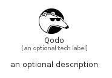

# Qodo


```text
simpleicons-14/Q/Qodo
```

```text
include('simpleicons-14/Q/Qodo')
```


| Illustration | Qodo |
| :---: | :---: |
|  |  |


## Sprites
The item provides the following sriptes:

- `<$QodoXs>`
- `<$QodoSm>`
- `<$QodoMd>`
- `<$QodoLg>`


## Qodo

### Load remotely
```plantuml
@startuml
' configures the library
!global $LIB_BASE_LOCATION="https://raw.githubusercontent.com/tmorin/plantuml-libs/master/distribution"

' loads the library's bootstrap
!include $LIB_BASE_LOCATION/bootstrap.puml

' loads the package bootstrap
include('simpleicons-14/bootstrap')

' loads the Item which embeds the element Qodo
include('simpleicons-14/Q/Qodo')

' renders the element
Qodo('Qodo', 'Qodo', 'an optional tech label', 'an optional description')
@enduml
```

### Load locally
```plantuml
@startuml
' configures the library
!global $INCLUSION_MODE="local"
!global $LIB_BASE_LOCATION="../.."

' loads the library's bootstrap
!include $LIB_BASE_LOCATION/bootstrap.puml

' loads the package bootstrap
include('simpleicons-14/bootstrap')

' loads the Item which embeds the element Qodo
include('simpleicons-14/Q/Qodo')

' renders the element
Qodo('Qodo', 'Qodo', 'an optional tech label', 'an optional description')
@enduml
```

