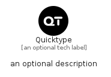

# Quicktype


```text
simpleicons-14/Q/Quicktype
```

```text
include('simpleicons-14/Q/Quicktype')
```


| Illustration | Quicktype |
| :---: | :---: |
|  |  |


## Sprites
The item provides the following sriptes:

- `<$QuicktypeXs>`
- `<$QuicktypeSm>`
- `<$QuicktypeMd>`
- `<$QuicktypeLg>`


## Quicktype

### Load remotely
```plantuml
@startuml
' configures the library
!global $LIB_BASE_LOCATION="https://raw.githubusercontent.com/tmorin/plantuml-libs/master/distribution"

' loads the library's bootstrap
!include $LIB_BASE_LOCATION/bootstrap.puml

' loads the package bootstrap
include('simpleicons-14/bootstrap')

' loads the Item which embeds the element Quicktype
include('simpleicons-14/Q/Quicktype')

' renders the element
Quicktype('Quicktype', 'Quicktype', 'an optional tech label', 'an optional description')
@enduml
```

### Load locally
```plantuml
@startuml
' configures the library
!global $INCLUSION_MODE="local"
!global $LIB_BASE_LOCATION="../.."

' loads the library's bootstrap
!include $LIB_BASE_LOCATION/bootstrap.puml

' loads the package bootstrap
include('simpleicons-14/bootstrap')

' loads the Item which embeds the element Quicktype
include('simpleicons-14/Q/Quicktype')

' renders the element
Quicktype('Quicktype', 'Quicktype', 'an optional tech label', 'an optional description')
@enduml
```

