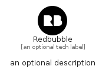

# Redbubble


```text
simpleicons-14/R/Redbubble
```

```text
include('simpleicons-14/R/Redbubble')
```


| Illustration | Redbubble |
| :---: | :---: |
|  |  |


## Sprites
The item provides the following sriptes:

- `<$RedbubbleXs>`
- `<$RedbubbleSm>`
- `<$RedbubbleMd>`
- `<$RedbubbleLg>`


## Redbubble

### Load remotely
```plantuml
@startuml
' configures the library
!global $LIB_BASE_LOCATION="https://raw.githubusercontent.com/tmorin/plantuml-libs/master/distribution"

' loads the library's bootstrap
!include $LIB_BASE_LOCATION/bootstrap.puml

' loads the package bootstrap
include('simpleicons-14/bootstrap')

' loads the Item which embeds the element Redbubble
include('simpleicons-14/R/Redbubble')

' renders the element
Redbubble('Redbubble', 'Redbubble', 'an optional tech label', 'an optional description')
@enduml
```

### Load locally
```plantuml
@startuml
' configures the library
!global $INCLUSION_MODE="local"
!global $LIB_BASE_LOCATION="../.."

' loads the library's bootstrap
!include $LIB_BASE_LOCATION/bootstrap.puml

' loads the package bootstrap
include('simpleicons-14/bootstrap')

' loads the Item which embeds the element Redbubble
include('simpleicons-14/R/Redbubble')

' renders the element
Redbubble('Redbubble', 'Redbubble', 'an optional tech label', 'an optional description')
@enduml
```

