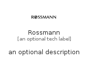

# Rossmann


```text
simpleicons-14/R/Rossmann
```

```text
include('simpleicons-14/R/Rossmann')
```


| Illustration | Rossmann |
| :---: | :---: |
|  |  |


## Sprites
The item provides the following sriptes:

- `<$RossmannXs>`
- `<$RossmannSm>`
- `<$RossmannMd>`
- `<$RossmannLg>`


## Rossmann

### Load remotely
```plantuml
@startuml
' configures the library
!global $LIB_BASE_LOCATION="https://raw.githubusercontent.com/tmorin/plantuml-libs/master/distribution"

' loads the library's bootstrap
!include $LIB_BASE_LOCATION/bootstrap.puml

' loads the package bootstrap
include('simpleicons-14/bootstrap')

' loads the Item which embeds the element Rossmann
include('simpleicons-14/R/Rossmann')

' renders the element
Rossmann('Rossmann', 'Rossmann', 'an optional tech label', 'an optional description')
@enduml
```

### Load locally
```plantuml
@startuml
' configures the library
!global $INCLUSION_MODE="local"
!global $LIB_BASE_LOCATION="../.."

' loads the library's bootstrap
!include $LIB_BASE_LOCATION/bootstrap.puml

' loads the package bootstrap
include('simpleicons-14/bootstrap')

' loads the Item which embeds the element Rossmann
include('simpleicons-14/R/Rossmann')

' renders the element
Rossmann('Rossmann', 'Rossmann', 'an optional tech label', 'an optional description')
@enduml
```

