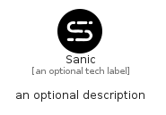

# Sanic


```text
simpleicons-14/S/Sanic
```

```text
include('simpleicons-14/S/Sanic')
```


| Illustration | Sanic |
| :---: | :---: |
|  |  |


## Sprites
The item provides the following sriptes:

- `<$SanicXs>`
- `<$SanicSm>`
- `<$SanicMd>`
- `<$SanicLg>`


## Sanic

### Load remotely
```plantuml
@startuml
' configures the library
!global $LIB_BASE_LOCATION="https://raw.githubusercontent.com/tmorin/plantuml-libs/master/distribution"

' loads the library's bootstrap
!include $LIB_BASE_LOCATION/bootstrap.puml

' loads the package bootstrap
include('simpleicons-14/bootstrap')

' loads the Item which embeds the element Sanic
include('simpleicons-14/S/Sanic')

' renders the element
Sanic('Sanic', 'Sanic', 'an optional tech label', 'an optional description')
@enduml
```

### Load locally
```plantuml
@startuml
' configures the library
!global $INCLUSION_MODE="local"
!global $LIB_BASE_LOCATION="../.."

' loads the library's bootstrap
!include $LIB_BASE_LOCATION/bootstrap.puml

' loads the package bootstrap
include('simpleicons-14/bootstrap')

' loads the Item which embeds the element Sanic
include('simpleicons-14/S/Sanic')

' renders the element
Sanic('Sanic', 'Sanic', 'an optional tech label', 'an optional description')
@enduml
```

