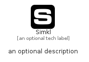

# Simkl


```text
simpleicons-14/S/Simkl
```

```text
include('simpleicons-14/S/Simkl')
```


| Illustration | Simkl |
| :---: | :---: |
|  |  |


## Sprites
The item provides the following sriptes:

- `<$SimklXs>`
- `<$SimklSm>`
- `<$SimklMd>`
- `<$SimklLg>`


## Simkl

### Load remotely
```plantuml
@startuml
' configures the library
!global $LIB_BASE_LOCATION="https://raw.githubusercontent.com/tmorin/plantuml-libs/master/distribution"

' loads the library's bootstrap
!include $LIB_BASE_LOCATION/bootstrap.puml

' loads the package bootstrap
include('simpleicons-14/bootstrap')

' loads the Item which embeds the element Simkl
include('simpleicons-14/S/Simkl')

' renders the element
Simkl('Simkl', 'Simkl', 'an optional tech label', 'an optional description')
@enduml
```

### Load locally
```plantuml
@startuml
' configures the library
!global $INCLUSION_MODE="local"
!global $LIB_BASE_LOCATION="../.."

' loads the library's bootstrap
!include $LIB_BASE_LOCATION/bootstrap.puml

' loads the package bootstrap
include('simpleicons-14/bootstrap')

' loads the Item which embeds the element Simkl
include('simpleicons-14/S/Simkl')

' renders the element
Simkl('Simkl', 'Simkl', 'an optional tech label', 'an optional description')
@enduml
```

