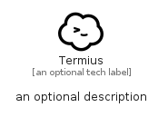

# Termius


```text
simpleicons-14/T/Termius
```

```text
include('simpleicons-14/T/Termius')
```


| Illustration | Termius |
| :---: | :---: |
|  |  |


## Sprites
The item provides the following sriptes:

- `<$TermiusXs>`
- `<$TermiusSm>`
- `<$TermiusMd>`
- `<$TermiusLg>`


## Termius

### Load remotely
```plantuml
@startuml
' configures the library
!global $LIB_BASE_LOCATION="https://raw.githubusercontent.com/tmorin/plantuml-libs/master/distribution"

' loads the library's bootstrap
!include $LIB_BASE_LOCATION/bootstrap.puml

' loads the package bootstrap
include('simpleicons-14/bootstrap')

' loads the Item which embeds the element Termius
include('simpleicons-14/T/Termius')

' renders the element
Termius('Termius', 'Termius', 'an optional tech label', 'an optional description')
@enduml
```

### Load locally
```plantuml
@startuml
' configures the library
!global $INCLUSION_MODE="local"
!global $LIB_BASE_LOCATION="../.."

' loads the library's bootstrap
!include $LIB_BASE_LOCATION/bootstrap.puml

' loads the package bootstrap
include('simpleicons-14/bootstrap')

' loads the Item which embeds the element Termius
include('simpleicons-14/T/Termius')

' renders the element
Termius('Termius', 'Termius', 'an optional tech label', 'an optional description')
@enduml
```

