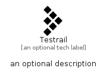

# Testrail


```text
simpleicons-14/T/Testrail
```

```text
include('simpleicons-14/T/Testrail')
```


| Illustration | Testrail |
| :---: | :---: |
|  |  |


## Sprites
The item provides the following sriptes:

- `<$TestrailXs>`
- `<$TestrailSm>`
- `<$TestrailMd>`
- `<$TestrailLg>`


## Testrail

### Load remotely
```plantuml
@startuml
' configures the library
!global $LIB_BASE_LOCATION="https://raw.githubusercontent.com/tmorin/plantuml-libs/master/distribution"

' loads the library's bootstrap
!include $LIB_BASE_LOCATION/bootstrap.puml

' loads the package bootstrap
include('simpleicons-14/bootstrap')

' loads the Item which embeds the element Testrail
include('simpleicons-14/T/Testrail')

' renders the element
Testrail('Testrail', 'Testrail', 'an optional tech label', 'an optional description')
@enduml
```

### Load locally
```plantuml
@startuml
' configures the library
!global $INCLUSION_MODE="local"
!global $LIB_BASE_LOCATION="../.."

' loads the library's bootstrap
!include $LIB_BASE_LOCATION/bootstrap.puml

' loads the package bootstrap
include('simpleicons-14/bootstrap')

' loads the Item which embeds the element Testrail
include('simpleicons-14/T/Testrail')

' renders the element
Testrail('Testrail', 'Testrail', 'an optional tech label', 'an optional description')
@enduml
```

