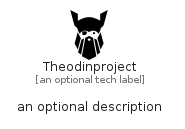

# Theodinproject


```text
simpleicons-14/T/Theodinproject
```

```text
include('simpleicons-14/T/Theodinproject')
```


| Illustration | Theodinproject |
| :---: | :---: |
|  |  |


## Sprites
The item provides the following sriptes:

- `<$TheodinprojectXs>`
- `<$TheodinprojectSm>`
- `<$TheodinprojectMd>`
- `<$TheodinprojectLg>`


## Theodinproject

### Load remotely
```plantuml
@startuml
' configures the library
!global $LIB_BASE_LOCATION="https://raw.githubusercontent.com/tmorin/plantuml-libs/master/distribution"

' loads the library's bootstrap
!include $LIB_BASE_LOCATION/bootstrap.puml

' loads the package bootstrap
include('simpleicons-14/bootstrap')

' loads the Item which embeds the element Theodinproject
include('simpleicons-14/T/Theodinproject')

' renders the element
Theodinproject('Theodinproject', 'Theodinproject', 'an optional tech label', 'an optional description')
@enduml
```

### Load locally
```plantuml
@startuml
' configures the library
!global $INCLUSION_MODE="local"
!global $LIB_BASE_LOCATION="../.."

' loads the library's bootstrap
!include $LIB_BASE_LOCATION/bootstrap.puml

' loads the package bootstrap
include('simpleicons-14/bootstrap')

' loads the Item which embeds the element Theodinproject
include('simpleicons-14/T/Theodinproject')

' renders the element
Theodinproject('Theodinproject', 'Theodinproject', 'an optional tech label', 'an optional description')
@enduml
```

